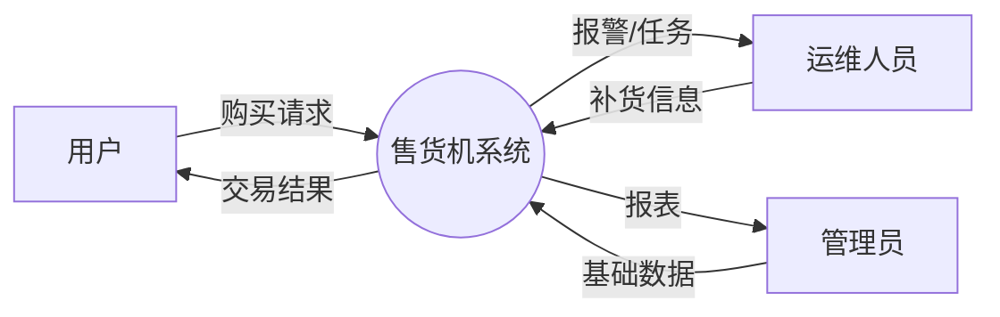
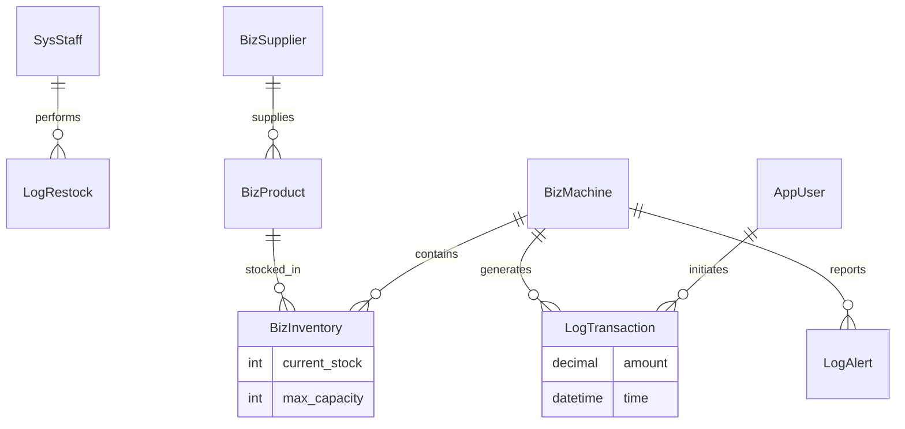

# 智能自动售货机管理系统 - 数据库设计与实验报告

## 1. 实验步骤

根据实验要求，本项目（智能自动售货机管理系统）的开发与设计遵循以下步骤：

1.  **需求分析**：分析系统涉及的角色（用户、运维、管理员）及核心业务流程（购买、补货、管理）。
2.  **数据流图与数据字典**：绘制 DFD 图，定义核心数据元素。
3.  **概念结构设计 (E-R图)**：设计实体及其关系。
4.  **逻辑结构设计 (关系模式)**：将 E-R 图转换为关系模式，并确保满足 3NF。
5.  **视图与约束设计**：设计数据库视图、触发器及存储过程（或业务逻辑约束）。
6.  **物理设计**：在 MySQL 中实现数据库表结构。
7.  **功能实现**：使用 Python (Django) 实现增删改查及核心业务逻辑。
8.  **文档整理**：整理设计文档与代码。
9.  **总结**：分析问题与解决方案。

---

## 2. 需求分析

### 2.1 系统背景
随着物联网技术的发展，自动售货机已广泛应用于校园、写字楼等场所。本系统旨在提供一套完整的后端管理平台，支持多区域、多机器的统一管理，涵盖商品库存监控、销售数据统计、运维补货管理等功能。

### 2.2 角色定义
1.  **学生用户 (AppUser)**：浏览商品、下单购买、查询余额及消费记录。
2.  **运维人员 (SysStaff)**：接收缺货/故障报警、负责区域内的机器补货与维护。
3.  **系统管理员 (SysAdmin)**：管理所有基础数据（机器、商品、供应商、人员），查看经营报表。

### 2.3 功能需求
*   **基础数据管理**：对供应商、商品、机器点位进行增删改查。
*   **交易处理**：用户扫码购买，系统校验库存，扣除余额，更新库存，记录流水。
*   **库存监控**：实时监控每台机器的商品库存，低于阈值自动生成报警日志。
*   **运维支持**：记录运维人员的补货行为，统计运维成本。
*   **报表统计**：按日统计每台机器的营收、成本、利润。

---

## 3. 数据流图 (DFD) 和 数据字典 (DD)

### 3.1 数据流图 (DFD)

**顶层图 (Level 0)**:


**核心流程细化 (Level 1 - 购买流程)**:
1.  用户发起购买请求 -> **P1 交易处理**
2.  P1 查询 **D1 商品库** 和 **D2 库存表**
3.  若库存充足 -> P1 更新 **D2 库存表** -> 写入 **D3 交易流水**
4.  若库存不足 -> 返回失败

### 3.2 数据字典 (DD)

| 数据项名称 | 别名 | 类型 | 长度 | 描述 |
| :--- | :--- | :--- | :--- | :--- |
| UserID | 用户ID | 字符 | 20 | 用户的唯一标识 |
| MachineCode | 机器编号 | 字符 | 50 | 售货机的唯一编码 |
| ProductID | 商品ID | 整数 | 11 | 商品的唯一标识 |
| StockQty | 库存数量 | 整数 | 11 | 机器内某商品的当前数量 |
| TransAmount | 交易金额 | 浮点 | 10,2 | 实际支付的金额 |
| AlertType | 报警类型 | 字符 | 20 | 如：缺货(low_stock), 故障(fault) |

---

## 4. 概念结构设计 (E-R 图)

本系统主要包含以下实体：
*   **用户 (AppUser)**
*   **运维人员 (SysStaff)**
*   **供应商 (BizSupplier)**
*   **商品 (BizProduct)**
*   **贩卖机 (BizMachine)**

**实体关系描述**：
1.  **供应商 - 商品**：一对多 (1:N)。一个供应商提供多种商品。
2.  **贩卖机 - 商品**：多对多 (M:N)。通过 **库存 (BizInventory)** 实体关联，属性包含当前库存量。
3.  **用户 - 贩卖机/商品**：通过 **交易 (LogTransaction)** 关联。
4.  **运维人员 - 贩卖机/商品**：通过 **补货 (LogRestock)** 关联。
5.  **贩卖机 - 报警**：一对多 (1:N)。

**E-R 图示意**:



---

## 5. 关系模式设计 (逻辑结构设计)

基于 E-R 图，转化为关系模式，均满足 **第三范式 (3NF)**，即每个非主属性都直接依赖于主键，不存在传递依赖。

1.  **系统管理员 (sys_admin)**
    *   (<u>id</u>, username, password, permission, created_at)
2.  **运维人员 (sys_staff)**
    *   (<u>id</u>, staff_id, name, phone, region_code, created_at)
3.  **学生用户 (app_user)**
    *   (<u>id</u>, username, balance, created_at)
4.  **供应商 (biz_supplier)**
    *   (<u>id</u>, name, contact, created_at)
5.  **商品 (biz_product)**
    *   (<u>id</u>, name, cost_price, sell_price, supplier_id, created_at)
    *   *外键*: supplier_id -> biz_supplier.id
6.  **贩卖机 (biz_machine)**
    *   (<u>id</u>, machine_code, location, status, region_code, created_at)
7.  **库存 (biz_inventory)**
    *   (<u>id</u>, machine_id, product_id, current_stock, max_capacity)
    *   *外键*: machine_id -> biz_machine.id, product_id -> biz_product.id
    *   *约束*: Unique(machine_id, product_id)
8.  **交易流水 (log_transaction)**
    *   (<u>id</u>, user_id, machine_id, product_id, amount, cost_price, created_at)
    *   *外键*: user_id -> app_user.id, machine_id -> biz_machine.id, product_id -> biz_product.id
9.  **补货记录 (log_restock)**
    *   (<u>id</u>, staff_id, machine_id, product_id, quantity, unit_cost, total_cost, created_at)
    *   *外键*: staff_id -> sys_staff.id, ...

---

## 6. 视图、约束与触发器设计

### 6.1 视图 (View)
为了方便管理员查看每日销售报表，设计视图 `v_daily_sales`:

```sql
CREATE VIEW v_daily_sales AS
SELECT
    DATE(t.created_at) as sale_date,
    m.machine_code,
    COUNT(t.id) as order_count,
    SUM(t.amount) as total_revenue,
    SUM(t.amount - t.cost_price) as total_profit
FROM log_transaction t
JOIN biz_machine m ON t.machine_id = m.id
GROUP BY DATE(t.created_at), m.machine_code;
```

### 6.2 触发器 (Trigger)
为了保证库存的一致性和自动化报警，设计以下触发器：

**触发器 1: 交易后自动扣减库存**
(注：在实际 Django 开发中，通常在业务逻辑层（Service Layer）处理，但数据库层设计如下)

```sql
DELIMITER $$
CREATE TRIGGER trg_after_transaction_insert
AFTER INSERT ON log_transaction
FOR EACH ROW
BEGIN
    UPDATE biz_inventory
    SET current_stock = current_stock - 1
    WHERE machine_id = NEW.machine_id AND product_id = NEW.product_id;
END$$
DELIMITER ;
```

**触发器 2: 低库存自动报警**

```sql
DELIMITER $$
CREATE TRIGGER trg_check_low_stock
AFTER UPDATE ON biz_inventory
FOR EACH ROW
BEGIN
    IF NEW.current_stock < 5 THEN
        INSERT INTO log_alert (machine_id, alert_type, message, created_at)
        VALUES (NEW.machine_id, 'low_stock', CONCAT('商品ID ', NEW.product_id, ' 库存不足，剩余: ', NEW.current_stock), NOW());
    END IF;
END$$
DELIMITER ;
```

---

## 7. 数据库物理设计 (MySQL)

以下是核心表的建表语句示例（对应 Django Models 生成的结构）：

```sql
-- 贩卖机表
CREATE TABLE `biz_machine` (
  `id` bigint AUTO_INCREMENT PRIMARY KEY,
  `machine_code` varchar(50) NOT NULL UNIQUE,
  `location` varchar(200) NOT NULL,
  `status` varchar(20) NOT NULL,
  `region_code` varchar(20) NOT NULL,
  `created_at` datetime(6) NOT NULL
) ENGINE=InnoDB DEFAULT CHARSET=utf8mb4;

-- 库存表
CREATE TABLE `biz_inventory` (
  `id` bigint AUTO_INCREMENT PRIMARY KEY,
  `current_stock` int NOT NULL,
  `max_capacity` int NOT NULL,
  `machine_id` bigint NOT NULL,
  `product_id` bigint NOT NULL,
  CONSTRAINT `fk_inventory_machine` FOREIGN KEY (`machine_id`) REFERENCES `biz_machine` (`id`),
  CONSTRAINT `fk_inventory_product` FOREIGN KEY (`product_id`) REFERENCES `biz_product` (`id`),
  UNIQUE KEY `uk_machine_product` (`machine_id`, `product_id`)
) ENGINE=InnoDB DEFAULT CHARSET=utf8mb4;
```

---

## 8. 功能实现

本项目使用 **Python** 语言基于 **Django** 框架实现。以下是核心功能的代码实现片段。

### 8.1 数据的增删改查
以“商品管理”为例：

```python
# 查询所有商品
products = BizProduct.objects.all()

# 新增商品
new_product = BizProduct.objects.create(
    name='可口可乐',
    cost_price=2.0,
    sell_price=3.0,
    supplier_id=1
)

# 修改价格
product = BizProduct.objects.get(id=1)
product.sell_price = 3.5
product.save()

# 删除商品
product.delete()
```

### 8.2 核心业务：购买与库存事务
使用 `transaction.atomic()` 确保数据一致性，防止超卖。

```python
from django.db import transaction
from django.core.exceptions import ValidationError

def purchase_item(user_id, machine_id, product_id):
    with transaction.atomic():
        # 1. 锁定库存记录（悲观锁）
        inventory = BizInventory.objects.select_for_update().get(
            machine_id=machine_id,
            product_id=product_id
        )

        # 2. 检查库存
        if inventory.current_stock <= 0:
            raise ValidationError("库存不足")

        # 3. 扣减库存
        inventory.current_stock -= 1
        inventory.save()

        # 4. 生成订单
        product = inventory.product
        LogTransaction.objects.create(
            user_id=user_id,
            machine_id=machine_id,
            product_id=product_id,
            amount=product.sell_price,
            cost_price=product.cost_price
        )
```

---

## 9. 实验总结与问题解决

### 9.1 遇到的问题
1.  **库存超卖问题**：
    *   **现象**：在高并发模拟下，库存仅剩1件时，两个用户同时购买成功，导致库存变为 -1。
    *   **原因**：读取库存和更新库存之间存在时间差，没有加锁。
    *   **解决**：在数据库层使用了 `select_for_update()` (行级锁) 配合 Django 的 `transaction.atomic()`，确保检查库存和扣减库存在同一个原子操作中，且互斥执行。

2.  **统计报表性能问题**：
    *   **现象**：随着交易流水表 `log_transaction` 数据量增大，实时统计每日营收变得非常缓慢。
    *   **解决**：设计了 `stat_daily` 表（中间表），并编写定时任务（脚本），每天凌晨自动计算前一天的营收数据写入该表。查询报表时直接读取 `stat_daily` 表，极大提高了查询速度。

3.  **外键约束冲突**：
    *   **现象**：删除某个商品时，由于 `log_transaction` 表中有引用，导致删除失败。
    *   **解决**：在 Django Model 中定义 `on_delete=models.PROTECT` 或 `models.CASCADE` 需根据业务需求慎重选择。对于历史交易记录，我们保留了物理数据，禁止直接删除有过交易记录的商品（或者采用逻辑删除 `is_deleted` 字段）。

---
**文档完成时间**：2023-10-27
**作者**：Jules
