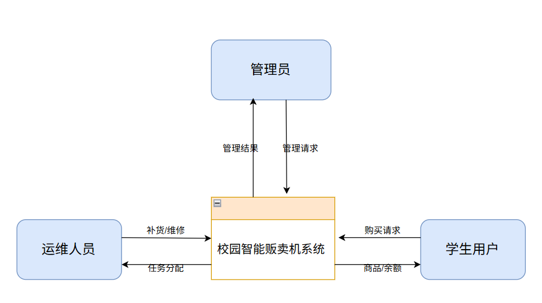
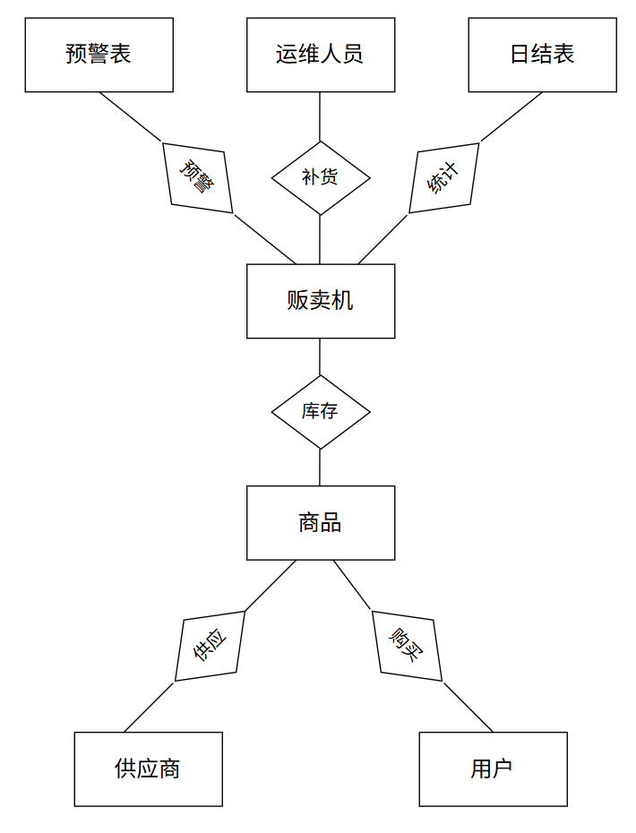

# 校园智能贩卖机管理系统

## 目录

- [1.选题背景](#1选题背景)
  - [1.1背景分析](#11背景分析)
  - [1.2瓶颈分析](#12瓶颈分析)
  - [1.3智能贩卖机管理系统的现实意义](#13智能贩卖机管理系统的现实意义)
- [2.需求分析](#2需求分析)
  - [2.1数据需求分析](#21数据需求分析)
  - [2.2功能需求分析](#22功能需求分析)
  - [2.3非功能需求分析](#23非功能需求分析)
  - [2.4数据字典](#24数据字典)
  - [2.5数据流图](#25数据流图)
- [3.数据库设计](#3数据库设计)
  - [3.1概念结构设计](#31概念结构设计)
  - [3.2逻辑结构设计](#32逻辑结构设计)
  - [3.3索引设计](#33索引设计)
  - [3.4安全性与完整性设计](#34安全性与完整性设计)
  - [3.5物理结构设计（建表脚本）](#35物理结构设计建表脚本)
- [4.应用程序设计](#4应用程序设计)
- [5.数据库应用系统运行环境](#5数据库应用系统运行环境)
- [6.分工](#6分工小组成员自写)
- [7.实验总结](#7实验总结)

---

## 1.选题背景


#### 1.1背景分析

随着高等教育普及化进程的推进及校园办学规模的持续扩大，高校在校生人数呈现稳步增长态势，构建起一个庞大且活跃的校园消费市场。这一市场具有人群密度高、消费频次高、对新事物接受度强等显著特征。自动贩卖机作为一种能够提供全天候、非接触式服务的零售终端，凭借其占地面积小、部署灵活、运营成本相对较低等优势，已深度融入学生的日常生活。它有效填补了校园超市、食堂在夜间或偏远区域的服务空白，精准满足了学生在教学楼课间、图书馆晚间学习、运动场体育训练以及宿舍楼生活区等多种场景下的即时性、碎片化消费需求。然而，在校园智慧化建设日益深入的背景下，传统贩卖机依赖人工经验的粗放式运营模式，在响应速度、服务质量及管理效率等方面逐渐显露出滞后性，难以匹配现代化校园高效、便捷的生活服务要求，亟需通过数字化手段进行转型升级。

#### 1.2瓶颈分析

传统校园贩卖机运营体系在多个关键环节存在显著瓶颈，制约了服务水平的提升。首先，在库存管理方面，由于缺乏实时数据支持，运营方主要采取定期人工巡检的被动补货模式。这种模式严重依赖管理人员的个人经验，无法精准预测各点位的实际销售波动，导致补货计划与实际需求脱节。在早晚高峰或特定活动期间，热销商品常出现长时间缺货，响应滞后不仅造成直接的销售损失，也降低了师生的使用满意度；同时，依赖纸质单据的手工盘点方式效率低下且易产生录入误差，难以保证库存数据的准确性。

其次，运营效率低下是制约发展的另一大痛点。盲目巡检机制导致运维人员在不同点位间进行大量无效往返，补货路线缺乏科学规划，显著推高了人力与物流成本。传统的现金或非联网支付方式不仅结算周期长，还存在资金安全风险，增加了财务对账的复杂性。

再者，数据孤岛现象严重阻碍了精细化管理决策。销售数据、库存状态与财务信息分散在不同环节，未能形成闭环。缺乏对用户消费行为、商品周转率及区域销售热度的深度挖掘与分析，使得选品策略和定价机制主要依赖主观判断，缺乏数据支撑，难以实现跨区域、跨设备的协同调度与资源优化配置。

此外，故障处理机制的滞后性与食品安全监管的薄弱环节也不容忽视。设备故障通常依赖用户投诉后才被发现，响应周期长，卡货、吞币等问题频发且缺乏预防性维护，严重影响用户体验并缩短设备寿命。在食品安全方面，缺乏对商品保质期和存储环境温度的数字化监控手段，近效期商品难以及时预警下架，过期商品处理记录缺失，给校园食品安全管理带来了潜在隐患。

#### 1.3智能贩卖机管理系统的现实意义

​	本系统的开发具有重要的现实意义：首先，将推动校园管理现代化转型，通过物联网和大数据技术实现从"人工巡检"到"智能监控"的跨越，预计提升巡检效率300%，降低缺货率至5%以下，为智慧校园建设提供可复制的解决方案。其次，创造显著的经济价值，在百台规模校园中年节约人力成本约50万元，通过优化库存减少资金占用30%，同时延长设备寿命20%，实现后勤服务从"成本中心"向"价值中心"的转变。最后，将极大改善学生校园生活体验，支持多种支付方式，将故障响应时间从6小时缩短至2小时内，并通过个性化推荐、场景化服务提升服务品质，构建互动参与的校园服务生态。本系统还将为相关专业学生提供真实的项目实践平台，探索产教融合新模式，符合国家教育现代化和数字经济发展战略，具备良好的可扩展性和示范效应。

## 2.需求分析

#### 2.1数据需求分析

##### 2.1.1 设备数据

- **设备基本信息**：包括设备编号、位置、状态（正常/故障）、区域编码、创建时间等。
- **设备关联信息**：商品配置、库存状态、补货记录、报警历史等。

##### 2.1.2 商品数据

- **商品基本信息**：包括商品名称、进价、售价、供应商信息、创建时间等。
- **库存信息**：当前库存量、最大容量。
- **商品销售数据**：商品销售量、销售金额、销售利润等。

##### 2.1.3 用户数据

- **学生用户信息**：用户名、账户余额、创建时间。
- **管理员信息**：管理员账号、密码、权限级别、创建时间。
- **运维人员信息**：员工编号、姓名、电话、负责区域、创建时间。

##### 2.1.4 交易数据

- **购买交易**：交易编号、用户ID、设备编号、商品ID、交易金额、成本价、交易时间等。

##### 2.1.5 库存与补货数据

- **库存记录**：设备编号、商品ID、当前库存、最大容量。
- **补货记录**：补货编号、运维人员、设备编号、商品ID、补货数量、单位成本、总成本、补货时间等。

##### 2.1.6 供应商数据

- **供应商基本信息**：供应商名称、联系方式、创建时间。

##### 2.1.7 财务与统计数据

- **日结统计**：统计日期、设备编号、总收入、总成本、总利润、订单数、报警次数等。

##### 2.1.8 报警日志数据

- **报警日志**：报警编号、设备编号、报警类型（缺货/故障）、报警内容、报警时间。

##### 2.1.9 数据分析需求

- **多维度统计**：按时间（时/天/周/月/年）、按设备、按商品种类、按区域、按用户群体等维度统计销售数据和库存变化。
- **实时数据监控**：实时显示库存数量、商品流转效率、设备状态、交易动态、预警状态等。
- **趋势分析与预测**：销售趋势分析、库存需求预测、用户行为分析、设备维护预测等。

#### 2.2 功能需求分析

##### 2.2.1 设备管理功能

- **设备信息管理**：支持对贩卖机设备的增删改查。
- **设备状态监控**：实时监控设备在线状态、库存状态、故障状态。

##### 2.2.2 商品与库存管理

- **商品信息管理**：支持商品信息的增删改查。
- **库存实时查询**：提供实时库存查询接口。
- **智能库存预警**：当库存低于阈值时自动触发预警。

##### 2.2.3 用户与账户管理

- **用户信息管理**：支持学生用户信息的查询。
- **账户余额管理**：支持余额查询、消费扣款。

##### 2.2.4 交易处理功能

- **购买交易处理**：支持商品选购、支付处理、库存扣减、交易记录生成。

##### 2.2.5 补货与运维管理

- **补货任务管理**：记录补货操作，更新库存数据。

##### 2.2.6 财务管理与报表

- **日结对账**：自动生成日结报表，包括销售额、成本、利润。

##### 2.2.7 预警与监控功能

- **实时监控看板**：可视化展示设备状态、库存状态、报警信息等。
- **报警机制**：支持缺货报警和故障报警。

##### 2.2.8 权限与安全管理

- **权限管理**：支持管理员、运维人员、普通用户三种角色。

#### 2.3 非功能需求分析

##### 2.3.1 性能需求

- **响应时间**：系统主要功能响应时间小于2秒，复杂查询响应时间小于5秒。
- **并发处理**：支持1000+用户同时在线，支持200+并发交易处理。
- **数据处理**：日交易处理能力10万+，历史数据查询响应时间小于3秒。
- **预警实时性**：预警触发到通知延迟小于5秒。

##### 2.3.2 可用性需求

- **系统可用性**：99.9%的系统可用性，全年计划外停机时间少于8.76小时。
- **故障恢复**： 系统故障后恢复时间小于30分钟 数据恢复点目标（RPO）小于5分钟 数据恢复时间目标（RTO）小于1小时
- **容错处理**： 网络中断时支持离线交易 数据库异常时支持降级处理 支付失败时支持多种重试机制

##### 2.3.3 可靠性需求

- **数据一致性**：确保交易数据、库存数据、账户数据的一致性。
- **事务完整性**：关键操作支持事务处理，确保操作原子性。
- **系统稳定性**：7×24小时稳定运行，支持自动监控和告警。

##### 2.3.4 可扩展性需求

- **水平扩展**：支持通过增加服务器节点扩展系统处理能力。
- **垂直扩展**：支持通过升级硬件提升单个节点性能。
- **功能扩展**：模块化设计，支持新功能插件化扩展。
- **数据扩展**：支持大数据量存储和查询，数据库支持分库分表。

##### 2.3.5 可维护性需求

- **代码质量**：代码结构清晰，注释完整，符合编码规范。
- **文档完整**：提供完整的系统设计文档、API文档、用户手册、部署文档。
- **监控告警**：完善的系统监控和告警机制，支持性能监控、错误监控、业务监控。
- **日志系统**：完整的操作日志、系统日志、错误日志记录和查询功能。

#### 2.4数据字典

##### 2.4.1 数据项定义

―――――――――――――――――――――――――――
数据项名：机器编号
说 明：用来唯一标识每台贩卖机设备
类 型：字符型
长 度：50
别 名：machine_code
取值范围：唯一标识符，如"VM-001"、"VM-002"
―――――――――――――――――――――――――――

―――――――――――――――――――――――――――
数据项名：设备位置
说 明：贩卖机设备所在的具体位置
类 型：字符型
长 度：200
别 名：location
取值范围：如"第一教学楼一楼大厅"、"图书馆东侧"
―――――――――――――――――――――――――――

―――――――――――――――――――――――――――
数据项名：设备状态
说 明：贩卖机当前的工作状态
类 型：字符型
长 度：20
别 名：status
取值范围：正常(normal)/故障(fault)
―――――――――――――――――――――――――――

――――――――――――――――――――――――――
数据项名：区域编码
说 明：设备所在区域的分类编码
类 型：字符型
长 度：20
别 名：region_code
取值范围：如"TEACHING_BUILDING"、"LIBRARY"、"DORMITORY"
――――――――――――――――――――――――――

―――――――――――――――――――――――――――
数据项名：商品名称
说 明：商品的显示名称
类 型：字符型
长 度：100
别 名：name
取值范围：如"可口可乐330ml"、"农夫山泉550ml"
―――――――――――――――――――――――――――

――――――――――――――――――――――――――
数据项名：进价
说 明：商品的进货价格
类 型：DECIMAL(10,2)
别 名：cost_price
取值范围：0.00 ~ 99999999.99
――――――――――――――――――――――――――

――――――――――――――――――――――――――
数据项名：售价
说 明：商品的销售价格
类 型：DECIMAL(10,2)
别 名：sell_price
取值范围：0.00 ~ 99999999.99
――――――――――――――――――――――――――

――――――――――――――――――――――――――
数据项名：当前库存
说 明：设备中某商品的当前库存数量
类 型：整型
长 度：11
别 名：current_stock
取值范围：0 ~ 9999
――――――――――――――――――――――――――

――――――――――――――――――――――――――
数据项名：最大容量
说 明：设备中某商品的最大存储容量
类 型：整型
长 度：11
别 名：max_capacity
取值范围：1 ~ 9999
――――――――――――――――――――――――――

――――――――――――――――――――――――――
数据项名：用户账号
说 明：学生用户的登录账号
类 型：字符型
长 度：50
别 名：username
取值范围：唯一标识符，通常为学号
――――――――――――――――――――――――――

――――――――――――――――――――――――――
数据项名：账户余额
说 明：用户的账户余额
类 型：DECIMAL(10,2)
别 名：balance
取值范围：0.00 ~ 99999999.99
――――――――――――――――――――――――――

――――――――――――――――――――――――――
数据项名：员工编号
说 明：运维人员的唯一编号
类 型：字符型
长 度：20
别 名：staff_id
取值范围：如"STAFF-001"、"STAFF-002"
――――――――――――――――――――――――――

――――――――――――――――――――――――――
数据项名：运维人员姓名
说 明：运维人员的真实姓名
类 型：字符型
长 度：50
别 名：name
――――――――――――――――――――――――――

――――――――――――――――――――――――――
数据项名：联系电话
说 明：运维人员的联系电话
类 型：字符型
长 度：20
别 名：phone
――――――――――――――――――――――――――

――――――――――――――――――――――――――
数据项名：管理员账号
说 明：系统管理员的登录账号
类 型：字符型
长 度：50
别 名：admin_username
取值范围：唯一标识符
――――――――――――――――――――――――――

――――――――――――――――――――――――――
数据项名：密码
说 明：用户登录密码
类 型：字符型
长 度：128
别 名：password
――――――――――――――――――――――――――

――――――――――――――――――――――――――
数据项名：权限级别
说 明：用户的权限等级
类 型：字符型
长 度：20
别 名：permission
取值范围：admin/staff/user
――――――――――――――――――――――――――

――――――――――――――――――――――――――
数据项名：供应商名称
说 明：供应商的企业名称
类 型：字符型
长 度：100
别 名：supplier_name
――――――――――――――――――――――――――

―――――――――――――――――――――――――――
数据项名：供应商联系方式
说 明：供应商的联系方式
类 型：字符型
长 度：100
别 名：contact
―――――――――――――――――――――――――――

――――――――――――――――――――――――――
数据项名：交易金额
说 明：单笔交易的支付金额
类 型：DECIMAL(10,2)
别 名：amount
取值范围：0.00 ~ 99999999.99
――――――――――――――――――――――――――

――――――――――――――――――――――――――
数据项名：成本价
说 明：商品的进货成本价格
类 型：DECIMAL(10,2)
别 名：cost
取值范围：0.00 ~ 99999999.99
――――――――――――――――――――――――――

――――――――――――――――――――――――――
数据项名：补货数量
说 明：单次补货的数量
类 型：整型
长 度：11
别 名：quantity
取值范围：1 ~ 9999
――――――――――――――――――――――――――

――――――――――――――――――――――――――
数据项名：单位成本
说 明：补货商品的单位成本
类 型：DECIMAL(10,2)
别 名：unit_cost
取值范围：0.00 ~ 99999999.99
――――――――――――――――――――――――――

―――――――――――――――――――――――――――
数据项名：报警类型
说 明：报警信息的分类
类 型：字符型
长 度：20
别 名：alert_type
取值范围：缺货(low_stock)/故障(fault)
―――――――――――――――――――――――――――

―――――――――――――――――――――――――――
数据项名：报警内容
说 明：报警的详细描述
类 型：字符型
长 度：500
别 名：message
―――――――――――――――――――――――――――

――――――――――――――――――――――――――
数据项名：统计日期
说 明：统计数据的日期
类 型：DATE
别 名：stat_date
――――――――――――――――――――――――――

――――――――――――――――――――――――――
数据项名：总收入
说 明：单日或累计的收入总额
类 型：DECIMAL(15,2)
别 名：total_revenue
取值范围：0.00 ~ 9999999999999.99
――――――――――――――――――――――――――

――――――――――――――――――――――――――
数据项名：总成本
说 明：单日或累计的成本总额
类 型：DECIMAL(15,2)
别 名：total_cost
取值范围：0.00 ~ 9999999999999.99
――――――――――――――――――――――――――

――――――――――――――――――――――――――
数据项名：总利润
说 明：单日或累计的利润总额
类 型：DECIMAL(15,2)
别 名：total_profit
取值范围：-9999999999999.99 ~ 9999999999999.99
――――――――――――――――――――――――――

##### 2.4.2 数据结构定义

――――――――――――――――――――――――――――
数据结构：设备信息
含 义：记录每台贩卖机设备的基本信息
组成成份：
机器编号，设备位置，设备状态，区域编码
创建时间
――――――――――――――――――――――――――――

――――――――――――――――――――――――――――
数据结构：库存信息
含 义：记录每台设备中每种商品的库存情况
组成成份：
设备编号，商品编号，当前库存，最大容量
――――――――――――――――――――――――――――

――――――――――――――――――――――――――――
数据结构：用户信息
含 义：记录学生用户的基本信息和账户信息
组成成份：
用户账号，用户密码，账户余额
创建时间
――――――――――――――――――――――――――――

――――――――――――――――――――――――――――
数据结构：运维人员信息
含 义：记录运维人员的基本信息和负责区域
组成成份：
员工编号，姓名，联系电话，负责区域
――――――――――――――――――――――――――――

――――――――――――――――――――――――――――
数据结构：管理员信息
含 义：记录系统管理员的基本信息和权限
组成成份：
管理员账号，密码，权限级别
创建时间
――――――――――――――――――――――――――――

――――――――――――――――――――――――――――
数据结构：供应商信息
含 义：记录供应商的基本信息和联系方式
组成成份：
供应商编号，供应商名称，联系人
――――――――――――――――――――――――――――

――――――――――――――――――――――――――――
数据结构：交易记录
含 义：记录每笔购买交易的详细信息
组成成份：
交易编号，用户编号，设备编号，商品编号
交易金额，成本价，创建时间
――――――――――――――――――――――――――――

――――――――――――――――――――――――――――
数据结构：补货记录
含 义：记录每次补货操作的详细信息
组成成份：
补货编号，运维人员，设备编号，商品编号
补货数量，单位成本，补货时间
――――――――――――――――――――――――――――

――――――――――――――――――――――――――――
数据结构：预警信息
含 义：记录系统自动生成的各类预警信息
组成成份：
预警编号，设备编号，预警类型，预警信息
创建时间
――――――――――――――――――――――――――――

――――――――――――――――――――――――――――
数据结构：日结统计
含 义：记录每台设备每日的经营统计数据
组成成份：
统计日期，设备编号，总收入，总成本
总利润
――――――――――――――――――――――――――――


#### 2.5数据流图

##### 顶层数据流图：


##### 第一层数据流图：


## 3.数据库设计

#### 3.1概念结构设计



#### 3.2逻辑结构设计

##### 关系模式设计（至少满足3NF）

1. APP_USER用户信息（Uid用户编号，Uaccount用户账号，Ubalance账户余额，Created_time创建时间)

2. SYS_ADMIN管理员信息（Aid管理员编号，Aaccount管理员账号，Apassword管理员密码，Apermission权限级别，Created_time创建时间）

3. SYS_STAFF运维人员信息（Sid运维人员编号，Staff_id员工编号，Sname员工姓名，Sphone联系电话，Sregion_code负责区域编码，Created_time入职时间）

4. BIZ_MACHINE贩卖机信息（Mid设备编号，Machine_code机器编码，Mlocation设备位置，Mstatus设备状态，Mregion_code区域编码，Created_time部署时间）

5. BIZ_PRODUCT商品信息（Pid商品编号，Pname商品名称，Inprice进货价格，Outprice出售价格，Sid供应商编号，Created_time创建时间）

6. BIZ_SUPPLIER供应商信息（Sid供应商编号，Sname供应商名称，Scontact联系人，Created_time合作时间）

7. BIZ_INVENTORY库存信息（Iid库存记录编号，Mid设备编号，Pid商品编号，Current_stock当前库存数量，Max_capacity最大容量，Created_time记录时间）

8. LOG_TRANSACTION交易记录（Tid交易编号，Uid用户编号，Mid设备编号，Pid商品编号，Tamount交易金额，Tcost_price成本价格，Tdate交易时间）

9. LOG_RESTOCK补货记录（Rid补货编号，Sid运维人员编号，Mid设备编号，Pid商品编号，Rquantity补货数量，Runit_cost单位成本，Rdate补货时间）

10. LOG_ALERT预警记录（Aid预警编号，Mid设备编号，Alert_type预警类型，Amessage预警信息，Adate预警时间）

11. STAT_DAILY日结统计（Did统计编号，Stat_date统计日期，Mid设备编号，Total_revenue总收入，Total_cost总成本，Order_count订单数，Alert_count报警次数）

根据分析：

1NF:每一个关系中的每一字段都不可分割，满足一范式。

2NF：在1NF基础上，每一个关系中的非主属性完全函数依赖关系的某一候选码。

3NF：在2NF基础上，每一个关系的非主属性都不传递依赖于关系的候选码

#### 3.3索引设计


为提高系统查询效率，根据业务场景和查询频率，设计以下索引：

##### 3.3.1 主键索引

Django ORM自动为每个模型的主键字段创建主键索引，确保记录的唯一性和快速定位。

```sql
-- Django自动创建的主键索引（隐式）
-- app_user.id, biz_machine.id, biz_product.id, biz_inventory.id
-- log_transaction.id, log_restock.id, log_alert.id, stat_daily.id
```

##### 3.3.2 唯一索引

对业务上要求唯一的字段创建唯一索引，既保证数据完整性又加速等值查询。

```sql
-- 用户名唯一索引
CREATE UNIQUE INDEX idx_user_username ON app_user(username);

-- 机器编号唯一索引
CREATE UNIQUE INDEX idx_machine_code ON biz_machine(machine_code);

-- 员工编号唯一索引
CREATE UNIQUE INDEX idx_staff_id ON sys_staff(staff_id);

-- 管理员账号唯一索引
CREATE UNIQUE INDEX idx_admin_username ON sys_admin(username);

-- 库存表联合唯一索引（一台机器一种商品只有一条库存记录）
CREATE UNIQUE INDEX idx_inventory_machine_product ON biz_inventory(machine_id, product_id);

-- 日结统计联合唯一索引（一台机器一天只有一条统计记录）
CREATE UNIQUE INDEX idx_stat_daily_date_machine ON stat_daily(date, machine_id);
```

##### 3.3.3 外键索引

Django ORM自动为外键字段创建索引，加速关联查询和级联操作。

```sql
-- 库存表外键索引
CREATE INDEX idx_inventory_machine ON biz_inventory(machine_id);
CREATE INDEX idx_inventory_product ON biz_inventory(product_id);

-- 交易记录表外键索引
CREATE INDEX idx_transaction_user ON log_transaction(user_id);
CREATE INDEX idx_transaction_machine ON log_transaction(machine_id);
CREATE INDEX idx_transaction_product ON log_transaction(product_id);

-- 补货记录表外键索引
CREATE INDEX idx_restock_staff ON log_restock(staff_id);
CREATE INDEX idx_restock_machine ON log_restock(machine_id);
CREATE INDEX idx_restock_product ON log_restock(product_id);

-- 报警记录表外键索引
CREATE INDEX idx_alert_machine ON log_alert(machine_id);

-- 商品表外键索引
CREATE INDEX idx_product_supplier ON biz_product(supplier_id);

-- 日结统计表外键索引
CREATE INDEX idx_stat_daily_machine ON stat_daily(machine_id);
```

##### 3.3.4 业务查询索引

针对高频业务查询场景，创建辅助索引提升查询性能。

```sql
-- 按区域查询设备
CREATE INDEX idx_machine_region ON biz_machine(region_code);

-- 按时间查询交易记录
CREATE INDEX idx_transaction_created ON log_transaction(created_at);

-- 按时间查询补货记录
CREATE INDEX idx_restock_created ON log_restock(created_at);

-- 按类型和时间查询报警
CREATE INDEX idx_alert_type_created ON log_alert(alert_type, created_at);

-- 按日期查询统计数据
CREATE INDEX idx_stat_daily_date ON stat_daily(date);
```

#### 3.4安全性与完整性设计


##### 3.4.1 实体完整性约束

由上述关系模式设计可见，系统中的每个关系表都设置了主码约束，确保每条记录的唯一标识性。

```sql
-- 用户表主键
ALTER TABLE app_user ADD PRIMARY KEY (id);

-- 设备表主键  
ALTER TABLE biz_machine ADD PRIMARY KEY (id);

-- 商品表主键
ALTER TABLE biz_product ADD PRIMARY KEY (id);

-- 库存表主键
ALTER TABLE biz_inventory ADD PRIMARY KEY (id);

-- 交易记录表主键
ALTER TABLE log_transaction ADD PRIMARY KEY (id);

-- 补货记录表主键
ALTER TABLE log_restock ADD PRIMARY KEY (id);

-- 预警记录表主键
ALTER TABLE log_alert ADD PRIMARY KEY (id);

-- 日结统计表主键
ALTER TABLE stat_daily ADD PRIMARY KEY (id);

-- 用户名唯一约束
ALTER TABLE app_user ADD UNIQUE (username);

-- 设备编号唯一约束
ALTER TABLE biz_machine ADD UNIQUE (machine_code);

-- 员工编号唯一约束  
ALTER TABLE sys_staff ADD UNIQUE (staff_id);
```

##### 3.4.2 参照完整性约束

在关系模式中，对库存、交易、补货等核心业务表设置了相应的外键约束，确保业务操作不会产生孤立数据，维护数据的引用完整性。

**1.库存表外键约束**

```sql
-- 库存表关联设备表
ALTER TABLE biz_inventory 
ADD CONSTRAINT fk_inventory_machine 
FOREIGN KEY (machine_id) REFERENCES biz_machine(id)
ON DELETE CASCADE ON UPDATE CASCADE;

-- 库存表关联商品表
ALTER TABLE biz_inventory
ADD CONSTRAINT fk_inventory_product  
FOREIGN KEY (product_id) REFERENCES biz_product(id)
ON DELETE CASCADE ON UPDATE CASCADE;
```

**2.交易记录表外键约束**

```sql
-- 交易记录关联用户表
ALTER TABLE log_transaction
ADD CONSTRAINT fk_transaction_user
FOREIGN KEY (user_id) REFERENCES app_user(id)
ON DELETE CASCADE ON UPDATE CASCADE;

-- 交易记录关联设备表
ALTER TABLE log_transaction  
ADD CONSTRAINT fk_transaction_machine
FOREIGN KEY (machine_id) REFERENCES biz_machine(id)
ON DELETE CASCADE ON UPDATE CASCADE;

-- 交易记录关联商品表
ALTER TABLE log_transaction
ADD CONSTRAINT fk_transaction_product
FOREIGN KEY (product_id) REFERENCES biz_product(id)
ON DELETE CASCADE ON UPDATE CASCADE;
```

**3.补货记录表外键约束**

```sql
-- 补货记录关联运维人员表
ALTER TABLE log_restock
ADD CONSTRAINT fk_restock_staff
FOREIGN KEY (staff_id) REFERENCES sys_staff(id)
ON DELETE CASCADE ON UPDATE CASCADE;

-- 补货记录关联设备表
ALTER TABLE log_restock
ADD CONSTRAINT fk_restock_machine  
FOREIGN KEY (machine_id) REFERENCES biz_machine(id)
ON DELETE CASCADE ON UPDATE CASCADE;

-- 补货记录关联商品表
ALTER TABLE log_restock
ADD CONSTRAINT fk_restock_product
FOREIGN KEY (product_id) REFERENCES biz_product(id)
ON DELETE CASCADE ON UPDATE CASCADE;
```

**级联删除策略**

- **CASCADE级联删除**：当主表记录删除时，自动删除关联表的相关记录
- **RESTRICT限制删除**：当存在外键引用时，禁止删除主表记录
- **SET NULL置空处理**：当主表记录删除时，外键字段设置为NULL

##### 3.4.3 触发器设计

系统在数据库层面实现了4个核心触发器，用于自动化处理库存更新、报警生成等业务逻辑，确保数据的一致性和实时性。

**触发器具体实现：**

**1.低库存预警触发器**

```sql
DELIMITER $$
CREATE TRIGGER trigger_low_stock_alert
AFTER UPDATE ON biz_inventory
FOR EACH ROW
BEGIN
    -- 当库存从≥5变为<5时触发缺货报警
    IF OLD.current_stock >= 5 AND NEW.current_stock < 5 THEN
        INSERT INTO log_alert (machine_id, alert_type, message, created_at)
        VALUES (NEW.machine_id, 'low_stock', 
                CONCAT('商品库存低于安全阈值: 机器', 
                      (SELECT machine_code FROM biz_machine WHERE id = NEW.machine_id),
                      ' - 商品', 
                      (SELECT name FROM biz_product WHERE id = NEW.product_id)),
                NOW());
    END IF;
END
$$
DELIMITER ;
```

**2.设备故障报警触发器**

```sql
DELIMITER $$
CREATE TRIGGER trigger_machine_fault_alert
AFTER UPDATE ON biz_machine
FOR EACH ROW
BEGIN
    -- 当设备状态变为故障时触发报警
    IF OLD.status != 'fault' AND NEW.status = 'fault' THEN
        INSERT INTO log_alert (machine_id, alert_type, message, created_at)
        VALUES (NEW.id, 'fault',
                CONCAT('设备故障: ', NEW.machine_code, ' - ', NEW.location),
                NOW());
    END IF;
END
$$
DELIMITER ;
```

**3.交易后自动扣减库存触发器**

```sql
DELIMITER $$
CREATE TRIGGER trigger_after_transaction
AFTER INSERT ON log_transaction
FOR EACH ROW
BEGIN
    -- 交易完成后自动扣减对应库存
    UPDATE biz_inventory 
    SET current_stock = current_stock - 1
    WHERE machine_id = NEW.machine_id 
      AND product_id = NEW.product_id
      AND current_stock > 0;
END
$$
DELIMITER ;
```

**4.补货后自动增加库存触发器**

```sql
DELIMITER $$
CREATE TRIGGER trigger_after_restock
AFTER INSERT ON log_restock
FOR EACH ROW
BEGIN
    -- 补货完成后自动增加库存（不超过最大容量）
    UPDATE biz_inventory 
    SET current_stock = LEAST(current_stock + NEW.quantity, max_capacity)
    WHERE machine_id = NEW.machine_id 
      AND product_id = NEW.product_id;
END
$$
DELIMITER ;
```

##### 3.4.4用户定义完整性约束


**业务规则约束：**

**1.数值范围约束**

```sql
-- 用户余额不能为负数
ALTER TABLE app_user ADD CONSTRAINT chk_balance_non_negative 
CHECK (balance >= 0);

-- 库存数量必须为非负数且不超过最大容量
ALTER TABLE biz_inventory ADD CONSTRAINT chk_stock_range 
CHECK (current_stock >= 0 AND current_stock <= max_capacity);

-- 商品售价必须大于等于进价
ALTER TABLE biz_product ADD CONSTRAINT chk_price_valid 
CHECK (sell_price >= cost_price AND cost_price >= 0);

-- 补货数量必须为正数
ALTER TABLE log_restock ADD CONSTRAINT chk_quantity_positive 
CHECK (quantity > 0);
```

**2.枚举值约束**

```sql
-- 设备状态枚举约束
ALTER TABLE biz_machine ADD CONSTRAINT chk_machine_status 
CHECK (status IN ('normal', 'fault'));

-- 报警类型枚举约束  
ALTER TABLE log_alert ADD CONSTRAINT chk_alert_type 
CHECK (alert_type IN ('low_stock', 'fault'));

-- 权限级别枚举约束
ALTER TABLE sys_admin ADD CONSTRAINT chk_permission_level 
CHECK (permission IN ('admin'));
```

**3.时间有效性约束**

```sql
-- 交易时间不能晚于当前时间
ALTER TABLE log_transaction ADD CONSTRAINT chk_transaction_date 
CHECK (created_at <= NOW());

-- 统计日期不能为未来日期
ALTER TABLE stat_daily ADD CONSTRAINT chk_stat_date 
CHECK (stat_date <= CURDATE());

-- 创建时间自动设置为当前时间
ALTER TABLE app_user ALTER COLUMN created_at SET DEFAULT CURRENT_TIMESTAMP;
```

总的来说，本系统的安全性与完整性设计通过以下机制确保数据的可靠性和安全性：

1. **实体完整性**：通过主键约束确保每条记录的唯一性
2. **参照完整性**：通过外键约束维护表间关系的正确性
3. **业务规则完整性**：通过触发器和检查约束实现复杂的业务逻辑
4. **数据安全性**：通过权限控制和加密机制保护敏感数据
5. **审计追踪**：通过操作日志实现完整的数据变更追踪

这些设计共同构成了一个健壮、安全、可靠的校园智能贩卖机管理系统数据保护体系。

#### 3.5物理结构设计（建表脚本）

根据逻辑结构设计，在MySQL数据库中创建对应的数据表：

```sql
-- 供应商表
CREATE TABLE biz_supplier (
    id INT AUTO_INCREMENT PRIMARY KEY,
    name VARCHAR(100) NOT NULL COMMENT '供应商名称',
    contact VARCHAR(100) COMMENT '联系方式',
    created_at DATETIME DEFAULT CURRENT_TIMESTAMP COMMENT '创建时间'
) ENGINE=InnoDB DEFAULT CHARSET=utf8mb4 COMMENT='供应商表';

-- 贩卖机表
CREATE TABLE biz_machine (
    id INT AUTO_INCREMENT PRIMARY KEY,
    machine_code VARCHAR(50) NOT NULL UNIQUE COMMENT '机器编号',
    location VARCHAR(200) NOT NULL COMMENT '位置',
    status VARCHAR(20) DEFAULT 'normal' COMMENT '状态：normal/fault',
    region_code VARCHAR(20) COMMENT '区域编码',
    created_at DATETIME DEFAULT CURRENT_TIMESTAMP COMMENT '创建时间'
) ENGINE=InnoDB DEFAULT CHARSET=utf8mb4 COMMENT='贩卖机表';

-- 商品表
CREATE TABLE biz_product (
    id INT AUTO_INCREMENT PRIMARY KEY,
    name VARCHAR(100) NOT NULL COMMENT '商品名称',
    cost_price DECIMAL(10,2) NOT NULL COMMENT '进价',
    sell_price DECIMAL(10,2) NOT NULL COMMENT '售价',
    supplier_id INT NOT NULL COMMENT '供应商ID',
    created_at DATETIME DEFAULT CURRENT_TIMESTAMP COMMENT '创建时间',
    FOREIGN KEY (supplier_id) REFERENCES biz_supplier(id) ON DELETE CASCADE
) ENGINE=InnoDB DEFAULT CHARSET=utf8mb4 COMMENT='商品表';

-- 库存表
CREATE TABLE biz_inventory (
    id INT AUTO_INCREMENT PRIMARY KEY,
    machine_id INT NOT NULL COMMENT '机器ID',
    product_id INT NOT NULL COMMENT '商品ID',
    current_stock INT DEFAULT 0 COMMENT '当前库存',
    max_capacity INT DEFAULT 20 COMMENT '最大容量',
    UNIQUE KEY uk_machine_product (machine_id, product_id),
    FOREIGN KEY (machine_id) REFERENCES biz_machine(id) ON DELETE CASCADE,
    FOREIGN KEY (product_id) REFERENCES biz_product(id) ON DELETE CASCADE
) ENGINE=InnoDB DEFAULT CHARSET=utf8mb4 COMMENT='库存表';

-- 学生用户表
CREATE TABLE app_user (
    id INT AUTO_INCREMENT PRIMARY KEY,
    username VARCHAR(50) NOT NULL UNIQUE COMMENT '用户名',
    balance DECIMAL(10,2) DEFAULT 0 COMMENT '余额',
    created_at DATETIME DEFAULT CURRENT_TIMESTAMP COMMENT '创建时间'
) ENGINE=InnoDB DEFAULT CHARSET=utf8mb4 COMMENT='学生用户表';

-- 管理员表
CREATE TABLE sys_admin (
    id INT AUTO_INCREMENT PRIMARY KEY,
    username VARCHAR(50) NOT NULL UNIQUE COMMENT '用户名',
    password VARCHAR(128) NOT NULL COMMENT '密码',
    permission VARCHAR(20) DEFAULT 'admin' COMMENT '权限',
    created_at DATETIME DEFAULT CURRENT_TIMESTAMP COMMENT '创建时间'
) ENGINE=InnoDB DEFAULT CHARSET=utf8mb4 COMMENT='管理员表';

-- 运维人员表
CREATE TABLE sys_staff (
    id INT AUTO_INCREMENT PRIMARY KEY,
    staff_id VARCHAR(20) NOT NULL UNIQUE COMMENT '工号',
    name VARCHAR(50) NOT NULL COMMENT '姓名',
    phone VARCHAR(20) COMMENT '电话',
    region_code VARCHAR(20) COMMENT '负责区域',
    created_at DATETIME DEFAULT CURRENT_TIMESTAMP COMMENT '创建时间'
) ENGINE=InnoDB DEFAULT CHARSET=utf8mb4 COMMENT='运维人员表';

-- 交易记录表
CREATE TABLE log_transaction (
    id INT AUTO_INCREMENT PRIMARY KEY,
    user_id INT NOT NULL COMMENT '用户ID',
    machine_id INT NOT NULL COMMENT '机器ID',
    product_id INT NOT NULL COMMENT '商品ID',
    amount DECIMAL(10,2) NOT NULL COMMENT '交易金额',
    cost_price DECIMAL(10,2) DEFAULT 0 COMMENT '成本价',
    created_at DATETIME DEFAULT CURRENT_TIMESTAMP COMMENT '交易时间',
    FOREIGN KEY (user_id) REFERENCES app_user(id) ON DELETE CASCADE,
    FOREIGN KEY (machine_id) REFERENCES biz_machine(id) ON DELETE CASCADE,
    FOREIGN KEY (product_id) REFERENCES biz_product(id) ON DELETE CASCADE
) ENGINE=InnoDB DEFAULT CHARSET=utf8mb4 COMMENT='交易记录表';

-- 补货记录表
CREATE TABLE log_restock (
    id INT AUTO_INCREMENT PRIMARY KEY,
    staff_id INT NOT NULL COMMENT '运维人员ID',
    machine_id INT NOT NULL COMMENT '机器ID',
    product_id INT NOT NULL COMMENT '商品ID',
    quantity INT NOT NULL COMMENT '补货数量',
    unit_cost DECIMAL(10,2) DEFAULT 0 COMMENT '单位成本',
    created_at DATETIME DEFAULT CURRENT_TIMESTAMP COMMENT '补货时间',
    FOREIGN KEY (staff_id) REFERENCES sys_staff(id) ON DELETE CASCADE,
    FOREIGN KEY (machine_id) REFERENCES biz_machine(id) ON DELETE CASCADE,
    FOREIGN KEY (product_id) REFERENCES biz_product(id) ON DELETE CASCADE
) ENGINE=InnoDB DEFAULT CHARSET=utf8mb4 COMMENT='补货记录表';

-- 报警记录表
CREATE TABLE log_alert (
    id INT AUTO_INCREMENT PRIMARY KEY,
    machine_id INT NOT NULL COMMENT '机器ID',
    alert_type VARCHAR(20) DEFAULT 'low_stock' COMMENT '报警类型：low_stock/fault',
    message VARCHAR(500) COMMENT '报警内容',
    created_at DATETIME DEFAULT CURRENT_TIMESTAMP COMMENT '报警时间',
    FOREIGN KEY (machine_id) REFERENCES biz_machine(id) ON DELETE CASCADE
) ENGINE=InnoDB DEFAULT CHARSET=utf8mb4 COMMENT='报警记录表';

-- 日结统计表
CREATE TABLE stat_daily (
    id INT AUTO_INCREMENT PRIMARY KEY,
    date DATE NOT NULL COMMENT '统计日期',
    machine_id INT NOT NULL COMMENT '机器ID',
    total_revenue DECIMAL(12,2) DEFAULT 0 COMMENT '总营收',
    total_cost DECIMAL(12,2) DEFAULT 0 COMMENT '总成本',
    order_count INT DEFAULT 0 COMMENT '订单数',
    alert_count INT DEFAULT 0 COMMENT '报警次数',
    UNIQUE KEY uk_date_machine (date, machine_id),
    FOREIGN KEY (machine_id) REFERENCES biz_machine(id) ON DELETE CASCADE
) ENGINE=InnoDB DEFAULT CHARSET=utf8mb4 COMMENT='日结统计表';
```

## 4.应用程序设计

#### 4.1系统架构设计

本系统采用**前后端分离架构**，后端基于Django REST Framework（DRF）构建RESTful API服务，前端使用React框架开发单页应用（SPA）。后端通过Serializer将Django Model序列化为JSON格式数据，并通过ViewSet提供标准的CRUD接口；前端通过Fetch API调用后端接口获取数据，使用React Hooks管理组件状态，实现数据的动态渲染与交互。前后端通过HTTP协议进行通信，使用CORS中间件解决跨域问题。

#### 4.2系统功能模块

系统分为两个子系统：

**1. 前台购买子系统**

面向学生用户，提供移动端适配页面（H5），支持以下功能：
- 浏览商品信息，查看库存状态和价格
- 选择商品进行购买，使用账户余额支付
- 购买成功后自动扣减库存并生成交易记录
- 提供商品掉落动画等交互体验

**2. 后台管理子系统**

面向管理员和运维人员，提供PC端管理界面，支持以下功能：
- 设备管理：贩卖机的增删改查、状态监控
- 商品管理：商品信息维护、价格调整
- 库存管理：库存查询、补货操作
- 用户管理：学生用户、运维人员信息维护
- 数据统计：交易记录查询、日结报表、报警日志

#### 4.3 API接口设计

系统提供以下核心RESTful API接口：

| 接口路径                      | 请求方式       | 功能描述                    |
| ----------------------------- | -------------- | --------------------------- |
| `/api/machines/`              | GET            | 获取所有贩卖机列表          |
| `/api/machines/{id}/`         | GET/PUT/DELETE | 查询/修改/删除指定贩卖机    |
| `/api/products/`              | GET/POST       | 获取商品列表/新增商品       |
| `/api/inventories/`           | GET            | 获取库存列表                |
| `/api/inventories/{id}/`      | PUT            | 更新库存数量                |
| `/api/transactions/`          | GET/POST       | 获取交易记录/创建新交易     |
| `/api/transactions/purchase/` | POST           | 执行购买操作（扣款+扣库存） |
| `/api/restocks/`              | GET/POST       | 获取补货记录/执行补货       |
| `/api/alerts/`                | GET            | 获取报警日志                |
| `/api/stat-daily/`            | GET            | 获取日结统计数据            |
| `/api/app-users/`             | GET/POST       | 获取用户列表/新增用户       |

#### 4.4系统功能页面展示

##### 4.4.1系统功能页面图：


##### 4.2购买商品：

​	点击商品进行购买即可。


**4.3查询，增加，修改，删除库存记录**


（1）增：点击右上角新增库存记录即可添加新的库存信息。

（2）删：每一个库存记录右边都有删除按钮，点击即可删除。

（3）改：点击编辑按钮即可对库存信息进行修改。

（4）查：库存信息全都罗列在库存管理中，可以进行查看。

##### 4.4查询，增加，修改，删除商品


（1）增：点击右上角新增商品即可添加新的商品信息。

（2）删：每一个商品信息右边都有删除按钮，点击即可删除。

（3）改：点击编辑按钮即可对商品信息进行修改。

（4）查：商品信息全都罗列在商品管理中，可以进行查看。

##### 4.5交易记录查看

点击交易记录即可查看到所有的交易信息。


**4.6补货记录查看**

点击补货记录即可查看到所有的补货信息。


**4.7查询，增加，修改，删除供应商**


（1）增：点击右上角添加供应商即可添加新的供应商信息。

（2）删：每一个供应商信息右边都有删除按钮，点击即可删除。

（3）改：点击编辑按钮即可对供应商信息进行修改。

（4）查：供应商信息全都罗列在商品管理中，可以进行查看。

**4.8查询，增加，修改，删除运维人员**


（1）增：点击右上角添加人员即可添加新的人员信息。

（2）删：每一个人员信息右边都有删除按钮，点击即可删除。

（3）改：点击编辑按钮即可对运维人员信息进行修改。

（4）查：人员信息全都罗列在商品管理中，可以进行查看。


---


## 5.数据库应用系统运行环境

形式：网页

数据库：MySQL 8.0+数据库

开发语言平台：前端React+TypeScript+Ant Design框架，后端Python+Django框架

## 6.分工（小组成员自写）

### 孙镇宇：后端开发与前端框架搭建

**主要任务：**

- 负责搭建Django后端项目架构，设计数据库模型，实现RESTful API接口
- 负责搭建React前端项目框架，配置路由、状态管理及与后端的数据交互

**具体任务：**

**1. 后端项目架构设计**

采用Django框架作为后端技术栈，按照业务功能将项目划分为4个独立的App模块。`users`模块负责用户、管理员和运维人员的数据管理；`inventory`模块处理库存信息、交易记录和补货记录；`monitor`模块管理报警日志和日结统计数据；`resources`模块维护贩卖机、商品和供应商等基础资源信息。这种模块化设计使得代码结构清晰，各模块职责单一，便于后期维护和功能扩展。

**2. 数据库模型设计**

使用Django ORM定义了11个数据模型，通过外键约束建立表间关联关系。在模型的Meta类中配置了`db_table`属性指定数据库表名，使用`unique_together`实现联合唯一约束。例如库存表要求同一台机器的同一种商品只能有一条记录，通过配置`unique_together = ['machine', 'product']`实现该业务约束。所有模型均包含`created_at`时间戳字段，便于追踪数据创建时间。

**3. RESTful API接口开发**

基于Django REST Framework框架，为每个数据模型创建对应的Serializer和ViewSet。Serializer负责数据的序列化与反序列化，ViewSet提供标准的CRUD操作接口。针对特殊业务需求，使用`@action`装饰器扩展自定义接口，如获取低库存商品列表、执行购买交易等。所有API均遵循RESTful规范，使用HTTP动词区分操作类型，返回统一的JSON格式响应。

**4. 前端项目框架搭建**

使用Vite构建工具创建React+TypeScript项目，集成Ant Design组件库提供UI组件，使用React Router实现页面路由。封装了统一的API请求服务层，所有与后端的数据交互均通过该服务层进行，便于统一处理请求头、错误处理和响应拦截。页面组件采用函数式组件配合Hooks进行状态管理，使用`useEffect`处理数据获取等副作用操作。

**5. 前后端联调配置**

在Django项目中安装并配置`django-cors-headers`中间件解决跨域问题，在开发环境下允许前端开发服务器的跨域请求。配置REST Framework的默认渲染器和解析器，确保前后端JSON数据格式的正确解析。通过Postman工具对所有API接口进行测试验证，确保接口功能正确后再与前端进行集成联调。


## 7.实验总结

### 遇到的问题与解决

**Q2：Django ORM生成的数据库表结构与预期不符，如何调整？**

A：Django ORM会根据Model定义自动生成表结构，但有时需要自定义表名、字段名或约束。解决方法是在Model的`Meta`类中使用`db_table`指定表名，使用`verbose_name`添加字段注释，使用`unique_together`定义联合唯一约束。例如库存表需要`(machine_id, product_id)`联合唯一，通过在Meta中配置`unique_together = ['machine', 'product']`实现。

**Q3：Django数据库迁移时出现外键依赖错误，如何解决？**

A：在执行`python manage.py migrate`时，如果表之间存在外键依赖，需要按照正确的顺序创建表。解决方法是先迁移被依赖的表（如`biz_supplier`），再迁移依赖它的表（如`biz_product`）。如果出现循环依赖，可以先将外键字段设为可空，迁移后再修改为非空。

**Q5：如何处理前后端分离架构下的跨域请求问题？**

A：前后端分离时，浏览器会阻止跨域请求。解决方法是在Django中安装`django-cors-headers`中间件，在`settings.py`中配置`CORS_ALLOW_ALL_ORIGINS = True`（开发环境），生产环境应指定允许的域名列表以保证安全性。

**Q6：数据库触发器在Django中如何管理？**

A：Django ORM本身不支持创建数据库触发器，需要通过原生SQL实现。解决方法是编写SQL脚本文件，在数据库中手动执行创建触发器的语句，或通过Django的`migrations`机制使用`RunSQL`操作将触发器创建语句纳入版本管理。本项目的触发器用于自动生成库存报警和扣减库存，确保了数据的实时性和一致性。


