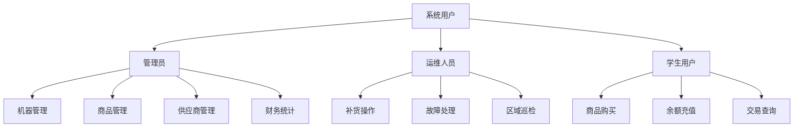
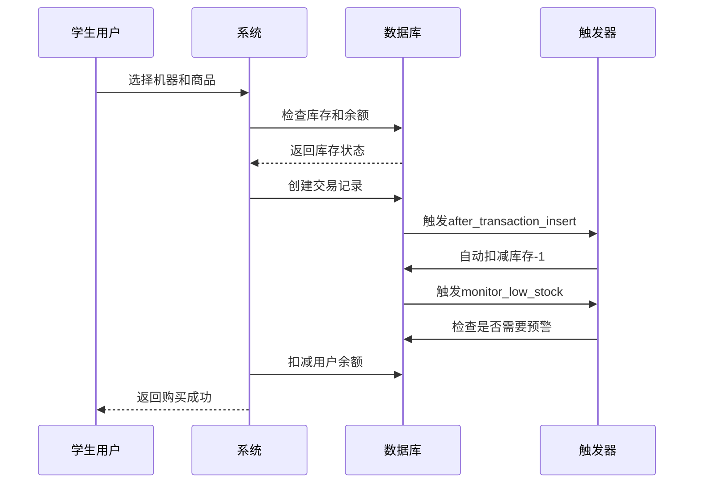
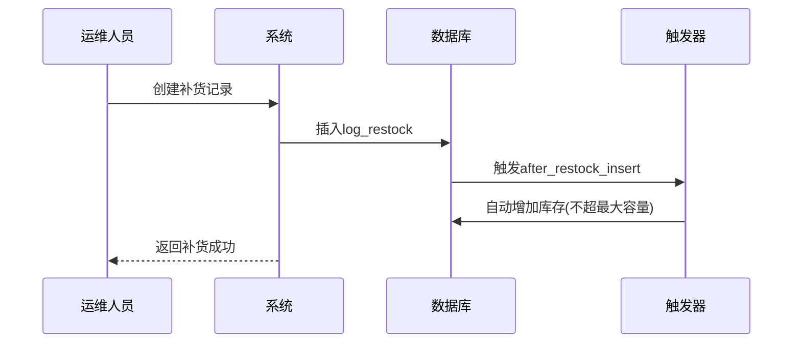
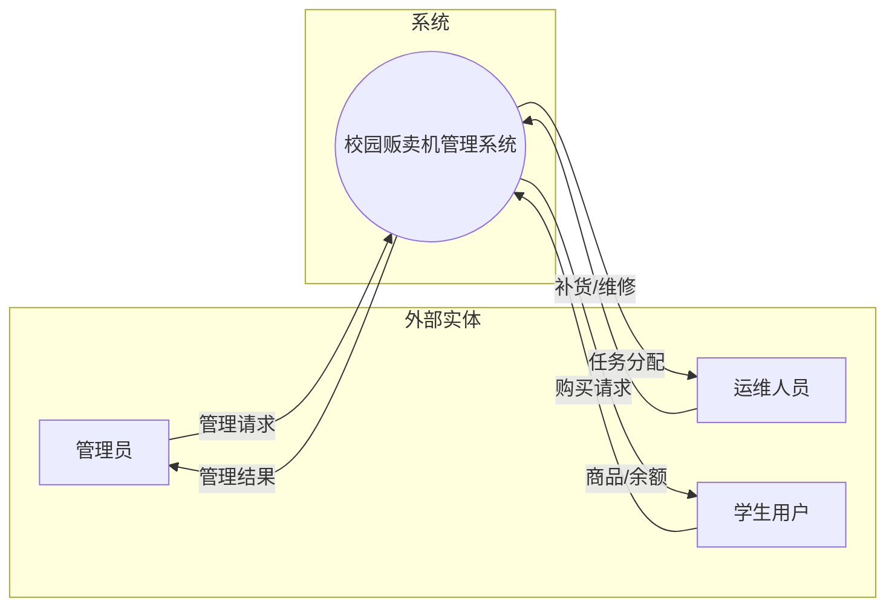
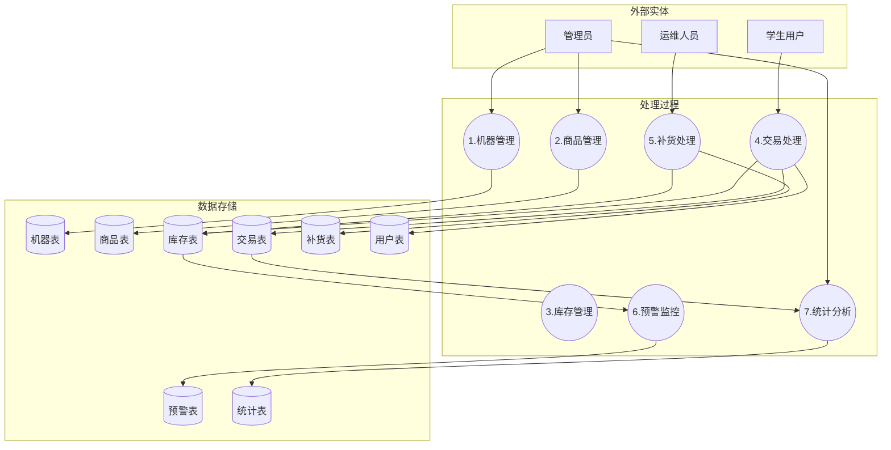
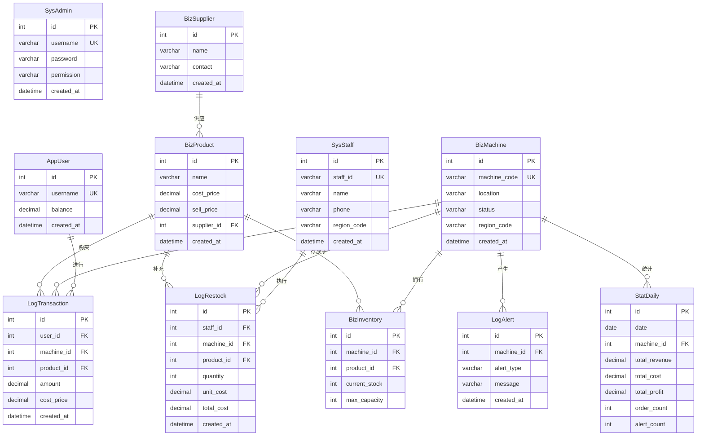
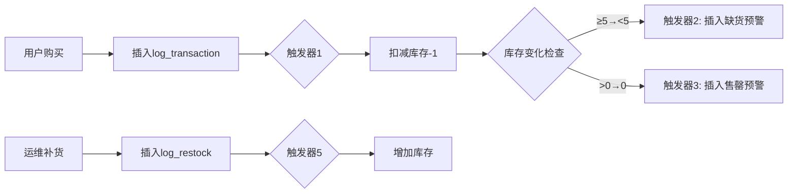

# 数据库系统实验报告

## 一、实验概述

本实验基于**校园智能贩卖机管理系统**项目，完整覆盖数据库设计与实现的全流程。

### 实验目标

针对校园自动贩卖机人工巡检效率低、缺货响应慢的问题，设计一套**全链路管理系统**，实现：

- 利用 **MySQL 触发器** 实现毫秒级库存预警
- 现代化 **React + TypeScript** 前端界面
- 完整的 **CRUD 管理** + **财务统计**
- 打通"销售-监控-补货-统计"闭环

### 技术栈

| 层级       | 技术                                              |
| ---------- | ------------------------------------------------- |
| **后端**   | Python 3.10+ / Django 6.0 / Django REST Framework |
| **数据库** | MySQL 8.0+ (必须，支持触发器)                     |
| **前端**   | React 19 / TypeScript / Ant Design / Vite         |
| **样式**   | Tailwind CSS / Framer Motion                      |

---

## 二、需求分析

### 2.1 系统功能需求

#### 2.1.1 核心业务需求

| 需求编号 | 功能名称   | 功能描述                                              |
| -------- | ---------- | ----------------------------------------------------- |
| F-001    | 机器管理   | 支持贩卖机的增删改查，状态管理（正常/故障），区域分配 |
| F-002    | 商品管理   | 支持商品的CRUD，进价/售价设置，供应商关联             |
| F-003    | 库存管理   | 机器-商品库存查询，库存预警提示，库存上下限控制       |
| F-004    | 用户管理   | 学生用户管理，余额查看与充值                          |
| F-005    | 供应商管理 | 供应商信息CRUD                                        |
| F-006    | 交易记录   | 交易流水查询，支持退货（自动恢复库存和余额）          |
| F-007    | 补货记录   | 补货历史查询，新建补货记录                            |
| F-008    | 运维人员   | 运维人员CRUD，区域分配                                |
| F-009    | 财务统计   | 总营收/成本/利润统计，日/周/月报表，机器营收排名      |
| F-010    | 移动端购买 | 模拟手机购买界面，选择机器和商品，自动扣款和库存更新  |

#### 2.1.2 监控预警需求

| 需求编号 | 预警类型 | 触发条件                     |
| -------- | -------- | ---------------------------- |
| M-001    | 缺货预警 | 库存从≥5降至<5时自动触发     |
| M-002    | 售罄预警 | 库存从>0降至=0时紧急触发     |
| M-003    | 故障预警 | 机器状态从正常变为故障时触发 |

### 2.2 用户角色分析



### 2.3 业务流程分析

#### 2.3.1 购买流程



#### 2.3.2 补货流程



---

## 三、数据流图

### 3.1 顶层数据流图（0层）



### 3.2 一层数据流图



---

## 四、数据字典

### 4.1 数据项定义

#### 4.1.1 机器相关

| 数据项名     | 含义     | 别名 | 类型    | 长度 | 取值范围      |
| ------------ | -------- | ---- | ------- | ---- | ------------- |
| machine_id   | 机器主键 | ID   | INT     | -    | 自增正整数    |
| machine_code | 机器编号 | 编号 | VARCHAR | 50   | 唯一标识符    |
| location     | 位置     | 地点 | VARCHAR | 200  | 校园位置描述  |
| status       | 状态     | -    | VARCHAR | 20   | normal/fault  |
| region_code  | 区域代码 | 区域 | VARCHAR | 20   | A区/B区/C区等 |

#### 4.1.2 商品相关

| 数据项名    | 含义     | 别名 | 类型    | 长度 | 取值范围    |
| ----------- | -------- | ---- | ------- | ---- | ----------- |
| product_id  | 商品主键 | ID   | INT     | -    | 自增正整数  |
| name        | 商品名称 | 名称 | VARCHAR | 100  | 商品名      |
| cost_price  | 进价     | 成本 | DECIMAL | 10,2 | ≥0.00       |
| sell_price  | 售价     | 价格 | DECIMAL | 10,2 | >cost_price |
| supplier_id | 供应商ID | -    | INT     | -    | 外键引用    |

#### 4.1.3 库存相关

| 数据项名      | 含义     | 别名 | 类型 | 长度 | 取值范围       |
| ------------- | -------- | ---- | ---- | ---- | -------------- |
| current_stock | 当前库存 | 库存 | INT  | -    | 0~max_capacity |
| max_capacity  | 最大容量 | 上限 | INT  | -    | 默认20         |

#### 4.1.4 用户相关

| 数据项名 | 含义   | 别名 | 类型    | 长度 | 取值范围 |
| -------- | ------ | ---- | ------- | ---- | -------- |
| username | 用户名 | 姓名 | VARCHAR | 50   | 唯一     |
| balance  | 余额   | 账户 | DECIMAL | 10,2 | ≥0.00    |

### 4.2 数据结构定义

| 结构名   | 含义         | 组成                                                                                  |
| -------- | ------------ | ------------------------------------------------------------------------------------- |
| 交易记录 | 一次购买交易 | {user_id, machine_id, product_id, amount, cost_price, created_at}                     |
| 补货记录 | 一次补货操作 | {staff_id, machine_id, product_id, quantity, unit_cost, total_cost, created_at}       |
| 预警记录 | 系统预警信息 | {machine_id, alert_type, message, created_at}                                         |
| 日结统计 | 每日经营统计 | {date, machine_id, total_revenue, total_cost, total_profit, order_count, alert_count} |

### 4.3 数据流定义

| 数据流名 | 说明         | 来源      | 去向     | 组成                   |
| -------- | ------------ | --------- | -------- | ---------------------- |
| 购买请求 | 用户购买商品 | 学生用户  | 交易处理 | 用户ID+机器ID+商品ID   |
| 交易结果 | 购买处理结果 | 交易处理  | 学生用户 | 成功/失败+余额变动     |
| 库存变动 | 库存数量变化 | 交易/补货 | 库存表   | 机器ID+商品ID+变动量   |
| 预警通知 | 异常情况通知 | 预警监控  | 管理员   | 机器信息+预警类型+消息 |

### 4.4 数据存储定义

| 存储名     | 说明               | 输入      | 输出      | 组成       | 存取方式  |
| ---------- | ------------------ | --------- | --------- | ---------- | --------- |
| 机器表     | 存储所有贩卖机信息 | 机器管理  | 各模块    | {机器信息} | 随机存取  |
| 商品表     | 存储所有商品信息   | 商品管理  | 交易/库存 | {商品信息} | 随机存取  |
| 库存表     | 存储库存状态       | 交易/补货 | 预警/统计 | {库存信息} | 随机存取  |
| 交易流水表 | 存储所有交易记录   | 交易处理  | 统计分析  | {交易记录} | 追加/查询 |

---

## 五、E-R图（概念结构设计）

### 5.1 实体定义

#### 5.1.1 实体属性表

| 实体名              | 属性                                 | 说明               |
| ------------------- | ------------------------------------ | ------------------ |
| 管理员(SysAdmin)    | 用户名, 密码, 权限, 创建时间         | 系统管理人员       |
| 运维人员(SysStaff)  | 工号, 姓名, 电话, 负责区域, 创建时间 | 负责补货和维修     |
| 学生用户(AppUser)   | 用户名, 余额, 创建时间               | 购买商品的终端用户 |
| 供应商(BizSupplier) | 名称, 联系方式, 创建时间             | 商品供应方         |
| 贩卖机(BizMachine)  | 机器编号, 位置, 状态, 区域, 创建时间 | 售卖商品的设备     |
| 商品(BizProduct)    | 名称, 进价, 售价, 供应商, 创建时间   | 可售卖的商品       |

### 5.2 E-R图



### 5.3 实体关系说明

| 关系名 | 实体1    | 实体2  | 关系类型 | 说明                       |
| ------ | -------- | ------ | -------- | -------------------------- |
| 供应   | 供应商   | 商品   | 1:N      | 一个供应商供应多种商品     |
| 库存   | 贩卖机   | 商品   | M:N      | 多对多关系，通过库存表实现 |
| 购买   | 用户     | 商品   | M:N      | 通过交易记录实现           |
| 补货   | 运维人员 | 贩卖机 | M:N      | 通过补货记录实现           |
| 预警   | 贩卖机   | 预警表 | 1:N      | 一台机器可产生多条预警     |
| 统计   | 贩卖机   | 日结表 | 1:N      | 一台机器每天有一条统计     |

---

## 六、关系模式设计（逻辑结构设计）

### 6.1 关系模式转换

将E-R图转换为满足**第三范式(3NF)**的关系模式：

#### 6.1.1 用户与权限模块

```
sys_admin(id, username, password, permission, created_at)
    主键: id
    候选键: username
    函数依赖: id → (username, password, permission, created_at)

sys_staff(id, staff_id, name, phone, region_code, created_at)
    主键: id
    候选键: staff_id
    函数依赖: id → (staff_id, name, phone, region_code, created_at)

app_user(id, username, balance, created_at)
    主键: id
    候选键: username
    函数依赖: id → (username, balance, created_at)
```

#### 6.1.2 资源模块

```
biz_supplier(id, name, contact, created_at)
    主键: id
    函数依赖: id → (name, contact, created_at)

biz_machine(id, machine_code, location, status, region_code, created_at)
    主键: id
    候选键: machine_code
    函数依赖: id → (machine_code, location, status, region_code, created_at)

biz_product(id, name, cost_price, sell_price, supplier_id, created_at)
    主键: id
    外键: supplier_id → biz_supplier(id)
    函数依赖: id → (name, cost_price, sell_price, supplier_id, created_at)
```

#### 6.1.3 核心业务模块

```
biz_inventory(id, machine_id, product_id, current_stock, max_capacity)
    主键: id
    外键: machine_id → biz_machine(id)
          product_id → biz_product(id)
    联合唯一约束: (machine_id, product_id)
    函数依赖: (machine_id, product_id) → (current_stock, max_capacity)

log_transaction(id, user_id, machine_id, product_id, amount, cost_price, created_at)
    主键: id
    外键: user_id → app_user(id)
          machine_id → biz_machine(id)
          product_id → biz_product(id)
    函数依赖: id → (用户, 机器, 商品, 金额, 成本, 时间)

log_restock(id, staff_id, machine_id, product_id, quantity, unit_cost, total_cost, created_at)
    主键: id
    外键: staff_id → sys_staff(id)
          machine_id → biz_machine(id)
          product_id → biz_product(id)
    函数依赖: id → (运维人员, 机器, 商品, 数量, 成本, 时间)
```

#### 6.1.4 监控与统计模块

```
log_alert(id, machine_id, alert_type, message, created_at)
    主键: id
    外键: machine_id → biz_machine(id)
    函数依赖: id → (机器, 类型, 消息, 时间)

stat_daily(id, date, machine_id, total_revenue, total_cost, total_profit, order_count, alert_count)
    主键: id
    外键: machine_id → biz_machine(id)
    联合唯一约束: (date, machine_id)
    函数依赖: (date, machine_id) → (营收, 成本, 利润, 订单数, 预警数)
```

### 6.2 范式验证

#### 6.2.1 第一范式(1NF)验证

✅ 所有表的每个属性都是原子值，不可再分

#### 6.2.2 第二范式(2NF)验证

✅ 所有非主属性完全依赖于主键，不存在部分依赖

#### 6.2.3 第三范式(3NF)验证

✅ 不存在传递依赖：
- `biz_product` 表中 `supplier_id` 只存储供应商ID，供应商详情在 `biz_supplier` 表中
- `log_transaction` 表中 `cost_price` 存储交易时刻的成本价，避免了对商品表的传递依赖

### 6.3 完整表结构（共11张表）

| 模块 | 表名            | 说明     | 关键字段                                       |
| ---- | --------------- | -------- | ---------------------------------------------- |
| 用户 | sys_admin       | 管理员   | 用户名, 密码, 权限                             |
| 用户 | sys_staff       | 运维人员 | 工号, 姓名, 电话, 负责区域                     |
| 用户 | app_user        | 学生用户 | 用户名, **余额**                               |
| 资源 | biz_supplier    | 供应商   | 名称, 联系方式                                 |
| 资源 | biz_machine     | 贩卖机   | 机器编号, 位置, **状态**, 区域                 |
| 资源 | biz_product     | 商品     | 名称, **进价**, **售价**, 供应商ID             |
| 业务 | biz_inventory   | 库存     | 机器ID, 商品ID, **当前库存**, 最大容量         |
| 业务 | log_transaction | 交易流水 | 用户ID, 机器ID, 商品ID, 金额, **成本价**       |
| 业务 | log_restock     | 补货记录 | 运维人员ID, 机器ID, 商品ID, 数量, **单位成本** |
| 监控 | log_alert       | 报警日志 | 机器ID, 类型, 报警内容                         |
| 统计 | stat_daily      | 日结统计 | 日期, 机器ID, 总营收, **总成本**, **总利润**   |

---

## 七、视图、约束、规则与触发器

### 7.1 视图设计

#### 7.1.1 低库存预警视图

```sql
CREATE VIEW v_low_stock_alert AS
SELECT 
    m.machine_code,
    m.location,
    p.name AS product_name,
    i.current_stock,
    i.max_capacity,
    CASE 
        WHEN i.current_stock = 0 THEN '售罄'
        WHEN i.current_stock < 5 THEN '低库存'
        ELSE '正常'
    END AS stock_status
FROM biz_inventory i
JOIN biz_machine m ON i.machine_id = m.id
JOIN biz_product p ON i.product_id = p.id
WHERE i.current_stock < 5;
```

#### 7.1.2 机器营收统计视图

```sql
CREATE VIEW v_machine_revenue AS
SELECT 
    m.machine_code,
    m.location,
    COUNT(t.id) AS transaction_count,
    SUM(t.amount) AS total_revenue,
    SUM(t.cost_price) AS total_cost,
    SUM(t.amount - t.cost_price) AS total_profit
FROM biz_machine m
LEFT JOIN log_transaction t ON m.id = t.machine_id
GROUP BY m.id, m.machine_code, m.location;
```

#### 7.1.3 用户消费统计视图

```sql
CREATE VIEW v_user_consumption AS
SELECT 
    u.username,
    u.balance,
    COUNT(t.id) AS purchase_count,
    COALESCE(SUM(t.amount), 0) AS total_spent
FROM app_user u
LEFT JOIN log_transaction t ON u.id = t.user_id
GROUP BY u.id, u.username, u.balance;
```

### 7.2 约束设计

#### 7.2.1 主键约束

所有表均使用自增整型 `id` 作为主键。

#### 7.2.2 唯一约束

```sql
-- 用户名唯一
ALTER TABLE sys_admin ADD CONSTRAINT uk_admin_username UNIQUE (username);
ALTER TABLE app_user ADD CONSTRAINT uk_user_username UNIQUE (username);

-- 机器编号唯一
ALTER TABLE biz_machine ADD CONSTRAINT uk_machine_code UNIQUE (machine_code);

-- 工号唯一
ALTER TABLE sys_staff ADD CONSTRAINT uk_staff_id UNIQUE (staff_id);

-- 库存联合唯一（每台机器每种商品只有一条库存记录）
ALTER TABLE biz_inventory ADD CONSTRAINT uk_inventory UNIQUE (machine_id, product_id);

-- 日结统计联合唯一（每台机器每天只有一条统计）
ALTER TABLE stat_daily ADD CONSTRAINT uk_stat_daily UNIQUE (date, machine_id);
```

#### 7.2.3 外键约束

```sql
-- 商品关联供应商
ALTER TABLE biz_product ADD CONSTRAINT fk_product_supplier 
    FOREIGN KEY (supplier_id) REFERENCES biz_supplier(id) ON DELETE CASCADE;

-- 库存关联机器和商品
ALTER TABLE biz_inventory ADD CONSTRAINT fk_inventory_machine 
    FOREIGN KEY (machine_id) REFERENCES biz_machine(id) ON DELETE CASCADE;
ALTER TABLE biz_inventory ADD CONSTRAINT fk_inventory_product 
    FOREIGN KEY (product_id) REFERENCES biz_product(id) ON DELETE CASCADE;

-- 交易记录外键
ALTER TABLE log_transaction ADD CONSTRAINT fk_transaction_user 
    FOREIGN KEY (user_id) REFERENCES app_user(id) ON DELETE CASCADE;
ALTER TABLE log_transaction ADD CONSTRAINT fk_transaction_machine 
    FOREIGN KEY (machine_id) REFERENCES biz_machine(id) ON DELETE CASCADE;
ALTER TABLE log_transaction ADD CONSTRAINT fk_transaction_product 
    FOREIGN KEY (product_id) REFERENCES biz_product(id) ON DELETE CASCADE;

-- 补货记录外键
ALTER TABLE log_restock ADD CONSTRAINT fk_restock_staff 
    FOREIGN KEY (staff_id) REFERENCES sys_staff(id) ON DELETE CASCADE;
ALTER TABLE log_restock ADD CONSTRAINT fk_restock_machine 
    FOREIGN KEY (machine_id) REFERENCES biz_machine(id) ON DELETE CASCADE;
ALTER TABLE log_restock ADD CONSTRAINT fk_restock_product 
    FOREIGN KEY (product_id) REFERENCES biz_product(id) ON DELETE CASCADE;

-- 预警关联机器
ALTER TABLE log_alert ADD CONSTRAINT fk_alert_machine 
    FOREIGN KEY (machine_id) REFERENCES biz_machine(id) ON DELETE CASCADE;

-- 日结统计关联机器
ALTER TABLE stat_daily ADD CONSTRAINT fk_stat_machine 
    FOREIGN KEY (machine_id) REFERENCES biz_machine(id) ON DELETE CASCADE;
```

#### 7.2.4 检查约束

```sql
-- 库存非负且不超最大容量
ALTER TABLE biz_inventory ADD CONSTRAINT chk_stock_range 
    CHECK (current_stock >= 0 AND current_stock <= max_capacity);

-- 余额非负
ALTER TABLE app_user ADD CONSTRAINT chk_balance 
    CHECK (balance >= 0);

-- 价格合理
ALTER TABLE biz_product ADD CONSTRAINT chk_price 
    CHECK (cost_price >= 0 AND sell_price >= 0);

-- 补货数量为正
ALTER TABLE log_restock ADD CONSTRAINT chk_quantity 
    CHECK (quantity > 0);

-- 机器状态限定
ALTER TABLE biz_machine ADD CONSTRAINT chk_status 
    CHECK (status IN ('normal', 'fault'));

-- 预警类型限定
ALTER TABLE log_alert ADD CONSTRAINT chk_alert_type 
    CHECK (alert_type IN ('low_stock', 'fault'));
```

### 7.3 规则设计

#### 7.3.1 业务规则

| 规则编号 | 规则名称     | 规则描述                         |
| -------- | ------------ | -------------------------------- |
| R-001    | 库存扣减规则 | 购买时库存自动-1，由触发器实现   |
| R-002    | 库存补充规则 | 补货时库存增加，但不超过最大容量 |
| R-003    | 余额扣减规则 | 购买时余额减少商品售价           |
| R-004    | 退货恢复规则 | 退货时自动恢复库存和用户余额     |
| R-005    | 成本记录规则 | 交易时记录当时的商品进价作为成本 |

### 7.4 触发器设计（5个）

#### 7.4.1 缺货预警触发器

```sql
CREATE TRIGGER monitor_low_stock
AFTER UPDATE ON biz_inventory
FOR EACH ROW
BEGIN
    IF NEW.current_stock < 5 AND OLD.current_stock >= 5 THEN
        INSERT INTO log_alert (machine_id, alert_type, message, created_at)
        VALUES (NEW.machine_id, 'low_stock',
                CONCAT('缺货预警: 商品ID ', NEW.product_id, ' 库存仅剩 ', NEW.current_stock),
                NOW());
    END IF;
END;
```

**触发条件**：库存更新后，库存从≥5降至<5时

**功能**：自动向 `log_alert` 表插入缺货预警记录

#### 7.4.2 售罄预警触发器

```sql
CREATE TRIGGER monitor_empty_stock
AFTER UPDATE ON biz_inventory
FOR EACH ROW
BEGIN
    IF NEW.current_stock = 0 AND OLD.current_stock > 0 THEN
        INSERT INTO log_alert (machine_id, alert_type, message, created_at)
        VALUES (NEW.machine_id, 'low_stock',
                CONCAT('紧急预警: 商品ID ', NEW.product_id, ' 已售罄!'),
                NOW());
    END IF;
END;
```

**触发条件**：库存更新后，库存从>0降至=0时

**功能**：自动向 `log_alert` 表插入售罄紧急预警

#### 7.4.3 故障预警触发器

```sql
CREATE TRIGGER monitor_machine_fault
AFTER UPDATE ON biz_machine
FOR EACH ROW
BEGIN
    IF NEW.status = 'fault' AND OLD.status = 'normal' THEN
        INSERT INTO log_alert (machine_id, alert_type, message, created_at)
        VALUES (NEW.id, 'fault',
                CONCAT('故障预警: 机器 ', NEW.machine_code, ' 发生故障'),
                NOW());
    END IF;
END;
```

**触发条件**：机器状态更新后，状态从"正常"变为"故障"时

**功能**：自动向 `log_alert` 表插入故障预警

#### 7.4.4 交易自动扣库存触发器

```sql
CREATE TRIGGER after_transaction_insert
AFTER INSERT ON log_transaction
FOR EACH ROW
BEGIN
    UPDATE biz_inventory
    SET current_stock = current_stock - 1
    WHERE machine_id = NEW.machine_id AND product_id = NEW.product_id;
END;
```

**触发条件**：交易记录插入后

**功能**：自动将对应库存减1

#### 7.4.5 补货自动增库存触发器

```sql
CREATE TRIGGER after_restock_insert
AFTER INSERT ON log_restock
FOR EACH ROW
BEGIN
    UPDATE biz_inventory
    SET current_stock = LEAST(current_stock + NEW.quantity, max_capacity)
    WHERE machine_id = NEW.machine_id AND product_id = NEW.product_id;
END;
```

**触发条件**：补货记录插入后

**功能**：自动增加库存，但不超过最大容量

### 7.5 触发器工作流程



---

## 八、数据库物理实现

### 8.1 数据库创建

```sql
CREATE DATABASE vending_db 
CHARACTER SET utf8mb4 
COLLATE utf8mb4_unicode_ci;

USE vending_db;
```

### 8.2 完整建表语句

#### 8.2.1 用户模块

```sql
-- 管理员表
CREATE TABLE sys_admin (
    id INT AUTO_INCREMENT PRIMARY KEY,
    username VARCHAR(50) NOT NULL UNIQUE,
    password VARCHAR(128) NOT NULL,
    permission VARCHAR(20) DEFAULT 'admin',
    created_at DATETIME DEFAULT CURRENT_TIMESTAMP
) ENGINE=InnoDB DEFAULT CHARSET=utf8mb4;

-- 运维人员表
CREATE TABLE sys_staff (
    id INT AUTO_INCREMENT PRIMARY KEY,
    staff_id VARCHAR(20) NOT NULL UNIQUE,
    name VARCHAR(50) NOT NULL,
    phone VARCHAR(20) NOT NULL,
    region_code VARCHAR(20) NOT NULL,
    created_at DATETIME DEFAULT CURRENT_TIMESTAMP
) ENGINE=InnoDB DEFAULT CHARSET=utf8mb4;

-- 学生用户表
CREATE TABLE app_user (
    id INT AUTO_INCREMENT PRIMARY KEY,
    username VARCHAR(50) NOT NULL UNIQUE,
    balance DECIMAL(10,2) DEFAULT 0.00,
    created_at DATETIME DEFAULT CURRENT_TIMESTAMP,
    CHECK (balance >= 0)
) ENGINE=InnoDB DEFAULT CHARSET=utf8mb4;
```

#### 8.2.2 资源模块

```sql
-- 供应商表
CREATE TABLE biz_supplier (
    id INT AUTO_INCREMENT PRIMARY KEY,
    name VARCHAR(100) NOT NULL,
    contact VARCHAR(100) NOT NULL,
    created_at DATETIME DEFAULT CURRENT_TIMESTAMP
) ENGINE=InnoDB DEFAULT CHARSET=utf8mb4;

-- 贩卖机表
CREATE TABLE biz_machine (
    id INT AUTO_INCREMENT PRIMARY KEY,
    machine_code VARCHAR(50) NOT NULL UNIQUE,
    location VARCHAR(200) NOT NULL,
    status VARCHAR(20) DEFAULT 'normal',
    region_code VARCHAR(20) NOT NULL,
    created_at DATETIME DEFAULT CURRENT_TIMESTAMP,
    CHECK (status IN ('normal', 'fault'))
) ENGINE=InnoDB DEFAULT CHARSET=utf8mb4;

-- 商品表
CREATE TABLE biz_product (
    id INT AUTO_INCREMENT PRIMARY KEY,
    name VARCHAR(100) NOT NULL,
    cost_price DECIMAL(10,2) NOT NULL,
    sell_price DECIMAL(10,2) NOT NULL,
    supplier_id INT NOT NULL,
    created_at DATETIME DEFAULT CURRENT_TIMESTAMP,
    FOREIGN KEY (supplier_id) REFERENCES biz_supplier(id) ON DELETE CASCADE,
    CHECK (cost_price >= 0 AND sell_price >= 0)
) ENGINE=InnoDB DEFAULT CHARSET=utf8mb4;
```

#### 8.2.3 业务模块

```sql
-- 库存表
CREATE TABLE biz_inventory (
    id INT AUTO_INCREMENT PRIMARY KEY,
    machine_id INT NOT NULL,
    product_id INT NOT NULL,
    current_stock INT DEFAULT 0,
    max_capacity INT DEFAULT 20,
    FOREIGN KEY (machine_id) REFERENCES biz_machine(id) ON DELETE CASCADE,
    FOREIGN KEY (product_id) REFERENCES biz_product(id) ON DELETE CASCADE,
    UNIQUE KEY uk_inventory (machine_id, product_id),
    CHECK (current_stock >= 0 AND current_stock <= max_capacity)
) ENGINE=InnoDB DEFAULT CHARSET=utf8mb4;

-- 交易流水表
CREATE TABLE log_transaction (
    id INT AUTO_INCREMENT PRIMARY KEY,
    user_id INT NOT NULL,
    machine_id INT NOT NULL,
    product_id INT NOT NULL,
    amount DECIMAL(10,2) NOT NULL,
    cost_price DECIMAL(10,2) DEFAULT 0.00,
    created_at DATETIME DEFAULT CURRENT_TIMESTAMP,
    FOREIGN KEY (user_id) REFERENCES app_user(id) ON DELETE CASCADE,
    FOREIGN KEY (machine_id) REFERENCES biz_machine(id) ON DELETE CASCADE,
    FOREIGN KEY (product_id) REFERENCES biz_product(id) ON DELETE CASCADE
) ENGINE=InnoDB DEFAULT CHARSET=utf8mb4;

-- 补货记录表
CREATE TABLE log_restock (
    id INT AUTO_INCREMENT PRIMARY KEY,
    staff_id INT NOT NULL,
    machine_id INT NOT NULL,
    product_id INT NOT NULL,
    quantity INT NOT NULL,
    unit_cost DECIMAL(10,2) DEFAULT 0.00,
    total_cost DECIMAL(12,2) DEFAULT 0.00,
    created_at DATETIME DEFAULT CURRENT_TIMESTAMP,
    FOREIGN KEY (staff_id) REFERENCES sys_staff(id) ON DELETE CASCADE,
    FOREIGN KEY (machine_id) REFERENCES biz_machine(id) ON DELETE CASCADE,
    FOREIGN KEY (product_id) REFERENCES biz_product(id) ON DELETE CASCADE,
    CHECK (quantity > 0)
) ENGINE=InnoDB DEFAULT CHARSET=utf8mb4;
```

#### 8.2.4 监控模块

```sql
-- 报警日志表
CREATE TABLE log_alert (
    id INT AUTO_INCREMENT PRIMARY KEY,
    machine_id INT NOT NULL,
    alert_type VARCHAR(20) DEFAULT 'low_stock',
    message VARCHAR(500) NOT NULL,
    created_at DATETIME DEFAULT CURRENT_TIMESTAMP,
    FOREIGN KEY (machine_id) REFERENCES biz_machine(id) ON DELETE CASCADE,
    CHECK (alert_type IN ('low_stock', 'fault'))
) ENGINE=InnoDB DEFAULT CHARSET=utf8mb4;

-- 日结统计表
CREATE TABLE stat_daily (
    id INT AUTO_INCREMENT PRIMARY KEY,
    date DATE NOT NULL,
    machine_id INT NOT NULL,
    total_revenue DECIMAL(12,2) DEFAULT 0.00,
    total_cost DECIMAL(12,2) DEFAULT 0.00,
    total_profit DECIMAL(12,2) DEFAULT 0.00,
    order_count INT DEFAULT 0,
    alert_count INT DEFAULT 0,
    FOREIGN KEY (machine_id) REFERENCES biz_machine(id) ON DELETE CASCADE,
    UNIQUE KEY uk_stat_daily (date, machine_id)
) ENGINE=InnoDB DEFAULT CHARSET=utf8mb4;
```

### 8.3 索引设计

```sql
-- 交易记录索引（提升查询性能）
CREATE INDEX idx_transaction_user ON log_transaction(user_id);
CREATE INDEX idx_transaction_machine ON log_transaction(machine_id);
CREATE INDEX idx_transaction_created ON log_transaction(created_at);

-- 库存索引
CREATE INDEX idx_inventory_stock ON biz_inventory(current_stock);

-- 预警索引
CREATE INDEX idx_alert_created ON log_alert(created_at);
CREATE INDEX idx_alert_type ON log_alert(alert_type);

-- 日结统计索引
CREATE INDEX idx_stat_date ON stat_daily(date);
```

---

## 九、功能实现

### 9.1 后端技术栈

系统后端采用 **Django REST Framework** 构建RESTful API。

#### 9.1.1 API端点设计

| 模块   | 端点                 | 方法                     |
| ------ | -------------------- | ------------------------ |
| 机器   | `/api/machines/`     | GET, POST, PUT, DELETE   |
| 商品   | `/api/products/`     | GET, POST, PUT, DELETE   |
| 库存   | `/api/inventories/`  | GET, POST, PUT, DELETE   |
| 交易   | `/api/transactions/` | GET, POST, DELETE (退货) |
| 补货   | `/api/restocks/`     | GET, POST, DELETE        |
| 用户   | `/api/app-users/`    | GET, POST, PUT, DELETE   |
| 供应商 | `/api/suppliers/`    | GET, POST, PUT, DELETE   |
| 运维   | `/api/sys-staffs/`   | GET, POST, PUT, DELETE   |
| 预警   | `/api/alerts/`       | GET                      |
| 日结   | `/api/stat-daily/`   | GET                      |

#### 9.1.2 财务统计API

```
GET  /api/stat-daily/summary/?period=week|month|today|all
POST /api/stat-daily/generate/  # 生成日结统计
GET  /api/transactions/statistics/?period=today|week|month
```

### 9.2 前端页面列表

| 页面名称   | 文件               | 功能描述                                     |
| ---------- | ------------------ | -------------------------------------------- |
| 仪表盘     | Dashboard.tsx      | 实时显示机器数量、低库存预警、今日营收等统计 |
| 机器管理   | Machines.tsx       | 贩卖机CRUD，状态管理，区域分配               |
| 商品管理   | Products.tsx       | 商品CRUD，进价/售价设置，供应商关联          |
| 库存管理   | Inventory.tsx      | 机器-商品库存查询，库存预警提示              |
| 用户管理   | Users.tsx          | 学生用户管理，余额查看                       |
| 供应商管理 | Suppliers.tsx      | 供应商信息CRUD                               |
| 交易记录   | Transactions.tsx   | 交易流水查询，支持退货                       |
| 补货记录   | Restocks.tsx       | 补货历史，新建补货记录                       |
| 运维人员   | Staff.tsx          | 运维人员CRUD，区域分配                       |
| 财务统计   | Statistics.tsx     | 总营收/成本/利润统计，日/周/月报表           |
| 移动端购买 | MobilePurchase.tsx | 模拟手机购买界面                             |

### 9.3 数据CRUD操作示例

#### 9.3.1 查询操作

```python
# 查询所有低库存商品
inventories = BizInventory.objects.filter(current_stock__lt=5)

# 查询某机器的所有交易
transactions = LogTransaction.objects.filter(machine_id=1).order_by('-created_at')

# 统计今日营收
from django.db.models import Sum
today_revenue = LogTransaction.objects.filter(
    created_at__date=date.today()
).aggregate(total=Sum('amount'))
```

#### 9.3.2 新增操作

```python
# 创建交易记录（触发器自动扣库存）
transaction = LogTransaction.objects.create(
    user_id=user.id,
    machine_id=machine.id,
    product_id=product.id,
    amount=product.sell_price,
    cost_price=product.cost_price
)
```

#### 9.3.3 修改操作

```python
# 更新机器状态（触发器自动预警）
machine = BizMachine.objects.get(id=1)
machine.status = 'fault'
machine.save()
```

#### 9.3.4 删除操作

```python
# 删除交易（退货，需手动恢复库存和余额）
transaction = LogTransaction.objects.get(id=1)
# 恢复库存
inventory = BizInventory.objects.get(
    machine_id=transaction.machine_id,
    product_id=transaction.product_id
)
inventory.current_stock += 1
inventory.save()
# 恢复余额
user = transaction.user
user.balance += transaction.amount
user.save()
# 删除记录
transaction.delete()
```

---

## 十、项目结构

```
database_homework/
├── vending_system/         # Django 项目配置
│   ├── settings.py         # 数据库配置
│   └── urls.py             # API 路由
├── users/                  # 用户模块 (SysAdmin, SysStaff, AppUser)
│   ├── models.py           # 用户相关数据模型
│   ├── serializers.py      # 序列化器
│   └── views.py            # 视图控制器
├── resources/              # 资源模块 (BizMachine, BizProduct, BizSupplier)
│   ├── models.py           # 资源相关数据模型
│   ├── serializers.py      # 序列化器
│   └── views.py            # 视图控制器
├── inventory/              # 库存模块 (BizInventory, LogTransaction, LogRestock)
│   ├── models.py           # 库存相关数据模型
│   ├── migrations/
│   │   └── 0002_create_triggers.py  # ⭐ 触发器定义
│   ├── serializers.py      # 序列化器
│   └── views.py            # 视图控制器
├── monitor/                # 监控模块 (LogAlert, StatDaily)
│   ├── models.py           # 监控相关数据模型
│   ├── serializers.py      # 序列化器
│   └── views.py            # 视图控制器
├── scripts/                # 初始化和测试脚本
│   ├── init_data.py        # 初始化测试数据
│   └── simulate_purchase.py # 模拟购买
└── frontend_new/           # React 前端
    ├── src/
    │   ├── pages/          # 页面组件
    │   ├── components/     # 公共组件
    │   └── api/            # API 配置
    └── package.json
```

---

## 十一、问题与解决方案

### 11.1 遇到的问题

| 问题编号 | 问题描述                                   | 解决方案                                     |
| -------- | ------------------------------------------ | -------------------------------------------- |
| P-001    | SQLite不支持触发器语法                     | 改用MySQL 8.0+数据库                         |
| P-002    | 库存重复扣减（Python代码和触发器同时扣减） | 移除Python端的库存扣减逻辑，统一由触发器处理 |
| P-003    | 财务统计显示为0                            | 确保交易记录正确关联cost_price字段           |
| P-004    | 跨域请求被阻止                             | 配置django-cors-headers允许前端跨域访问      |
| P-005    | 并发购买导致超卖                           | 使用select_for_update()实现行级锁            |
| P-006    | 时区时间不一致                             | 配置Django `USE_TZ = True` 使用UTC存储       |

### 11.2 关键技术点

1. **触发器级联**：交易插入 → 触发扣库存 → 触发库存检查 → 可能插入预警
2. **事务一致性**：使用Django `@transaction.atomic` 装饰器保证操作原子性
3. **成本快照**：交易时记录当时商品进价，避免后续价格变动影响历史统计

---

## 十二、实验总结

本实验完整实现了校园智能贩卖机管理系统，涵盖了数据库设计的全流程：

1. ✅ **需求分析**：明确了10大功能模块和3类监控预警
2. ✅ **数据流图**：绘制了0层和1层数据流图
3. ✅ **数据字典**：详细定义了数据项、数据结构、数据流和数据存储
4. ✅ **E-R图设计**：设计了11个实体及其关系
5. ✅ **关系模式设计**：转换为满足3NF的11张表
6. ✅ **视图与约束**：设计了3个视图和多种约束（主键、外键、唯一、检查）
7. ✅ **触发器实现**：实现了5个触发器用于自动化业务逻辑
8. ✅ **物理实现**：在MySQL 8.0+中创建数据库
9. ✅ **功能开发**：使用Django+React实现完整CRUD和统计功能
10. ✅ **问题解决**：记录并解决了6个关键问题

---

## 附录：原始实验要求


